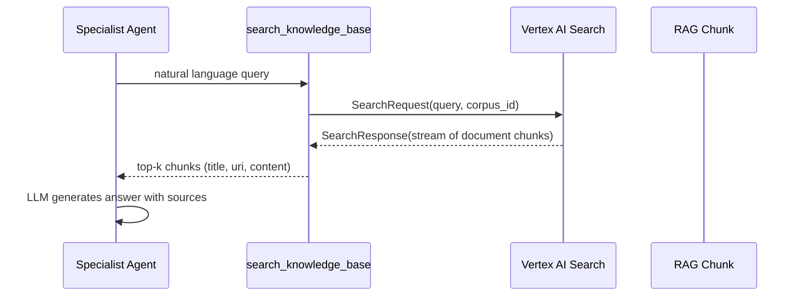

# ImmoAssist Enterprise Integration Patterns

## Обзор

ImmoAssist построен как enterprise система с четкими границами интеграции для легкой интеграции с существующими системами.

## Структура Проекта

```
app/
├── __init__.py              # Экспорт root_agent для ADK Web
├── agent.py                 # Многоагентная архитектура
├── config.py                # Enterprise конфигурация
├── models/                  # Domain models
├── tools/                   # Инструменты агентов
├── services/               # Бизнес-логика
└── utils/                  # Утилиты
```

## 1. Интеграция с Сайтом

### ADK Web Interface

```bash
http://localhost:8000/dev-ui/?app=app
```

### API Integration

```python
from app import root_agent
from app.services import SessionService

class ImmoAssistAPI:
    def __init__(self):
        self.session_service = SessionService()
        self.agent = root_agent

    async def chat(self, user_id: str, message: str):
        session = self.session_service.get_or_create_session(user_id)
        response = await self.agent.send_message(message, session.session_id)
        return {"response": response.content}
```

## 2. Внешние API

### HeyGen Integration

```python
class HeyGenIntegration:
    async def create_avatar_video(self, message: str):
        # HeyGen API integration
        pass
```

### Property Database Integration

```python
class PropertyService:
    def __init__(self):
        self.apis = {
            "immowelt": ImmoweltAPI(),
            "immoscout": ImmoscoutAPI()
        }
```

## 3. Configuration

```bash
# .env
ENVIRONMENT=production
DATABASE_URL=postgresql://...
HEYGEN_API_KEY=your_key
WEBSITE_API_BASE_URL=https://yoursite.com/api
```

## 4. Deployment

Система готова к production через Docker/Kubernetes с proper monitoring и security.

## 5. Vertex AI Search (RAG) Integration

ImmoAssist uses **Google Cloud Vertex AI Search (Discovery Engine)** as the backbone for Retrieval-Augmented Generation (RAG).

### Internal Tools

| Tool                                   | File                              | Purpose                                                                                                                    |
| -------------------------------------- | --------------------------------- | -------------------------------------------------------------------------------------------------------------------------- |
| `search_knowledge_base`                | `app/tools/knowledge_tools.py`    | Retrieve legal & process knowledge from Discovery Engine RAG corpus. Returns chunks with metadata and citations.           |
| `search_legal_rag`                     | `app/tools/legal_tools.py`        | Query legally-relevant corpus (e.g. BGB, BauGB).                                                                           |
| `search_presentation_rag`              | `app/tools/presentation_tools.py` | Retrieve marketing/presentation snippets (e.g. slides, brochures).                                                         |
| `vertex_search.query_discovery_engine` | `app/tools/vertex_search.py`      | Low-level wrapper around `DiscoveryEngine.SearchServiceClient.search_stream` with automatic pagination & safety-filtering. |

### Query Flow



### Configuration

Environment variables (see `.env`):

```bash
RAG_CORPUS=projects/<PROJECT_ID>/locations/<REGION>/ragCorpora/<CORPUS_ID>
LEGAL_RAG_CORPUS=projects/<PROJECT_ID>/locations/<REGION>/ragCorpora/<CORPUS_ID_LEGAL>
PRESENTATION_RAG_CORPUS=projects/<PROJECT_ID>/locations/<REGION>/ragCorpora/<CORPUS_ID_PRESENTATION>
```

### Adding New Corpora

1. Create corpus in Vertex AI Search (Discovery Engine) UI.
2. Upload documents (PDF, TXT, HTML) – automatic chunking is supported.
3. Add new environment variable `MY_NEW_CORPUS` and corresponding tool in `app/tools/*`.
4. Update `app/prompts/*.py` to instruct agent about new knowledge domain.

> Note: Each corpus is queried **streaming** to keep latency < 1.5s for top-5 chunks.
