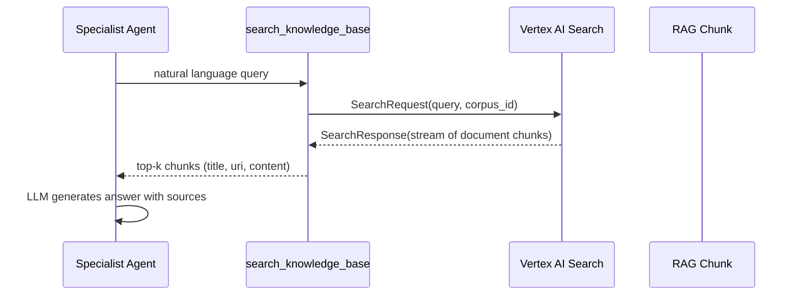

# ImmoAssist Enterprise Integration Patterns

## Обзор

ImmoAssist построен как enterprise система с четкими границами интеграции для легкой интеграции с существующими системами. Система основана на Google Agent Development Kit (ADK) 1.0.0 и использует Poetry для управления зависимостями.

## Структура проекта

```
app/
├── __init__.py              # Экспорт root_agent для ADK Web
├── agent.py                 # Многоагентная архитектура
├── config.py                # Enterprise конфигурация
├── health_checks.py         # Проверки состояния системы
├── observability.py         # Мониторинг и метрики
├── models/                  # Domain models
│   ├── financial.py         # Финансовые модели
│   ├── property.py          # Модели недвижимости
│   ├── user.py             # Пользовательские модели
│   └── output_schemas.py    # Схемы вывода инструментов
├── tools/                   # Инструменты агентов
│   ├── chart_tools.py       # Визуализация данных
│   ├── knowledge_tools.py   # RAG поиск
│   ├── property_tools.py    # Анализ недвижимости
│   ├── legal_tools.py       # Правовые инструменты
│   ├── datetime_tools.py    # Инструменты даты/времени
│   └── vertex_search.py     # Vertex AI Search wrapper
├── services/               # Бизнес-логика
│   └── session_service.py  # Управление сессиями
├── shared_libraries/       # Общие утилиты
│   ├── conversation_callbacks.py
│   ├── combined_callbacks.py
│   └── datetime_callback.py
└── prompts/               # Focused промпты агентов
    ├── root_agent_focused.py
    ├── calculator_specialist_focused.py
    ├── knowledge_specialist_focused.py
    ├── legal_specialist_focused.py
    ├── market_analyst_focused.py
    ├── presentation_specialist_focused.py
    ├── property_specialist_focused.py
    ├── coordination_specialist_focused.py
    ├── base_system_prompt.py
    ├── conversation_management.py
    ├── conversation_prompts.py
    ├── coordination_rules.py
    └── prompt_composer.py
```

## 1. Интеграция с веб-сайтом

### ADK Web Interface

```bash
http://localhost:8000/dev-ui/?app=app
```

### API Integration

```python
from app import root_agent
from app.services import SessionService

class ImmoAssistAPI:
    def __init__(self):
        self.session_service = SessionService()
        self.agent = root_agent

    async def chat(self, user_id: str, message: str):
        session = self.session_service.get_or_create_session(user_id)
        response = await self.agent.send_message(message, session.session_id)
        return {"response": response.content}
```

### FastAPI эндпоинты

```python
# Основные API эндпоинты
POST /run_sse                # Потоковый чат с агентами
GET /health                  # Проверка состояния системы
POST /tts-stream            # Text-to-Speech синтез
GET /dev-ui                 # Интерфейс разработчика ADK
```

## 2. Внешние API интеграции

### Vertex AI Search (RAG)

```python
# app/tools/vertex_search.py
class VertexSearchClient:
    async def query_discovery_engine(self, query: str, corpus_id: str):
        # Интеграция с Discovery Engine для RAG
        pass
```

### Property Database Integration

```python
class PropertyService:
    def __init__(self):
        self.apis = {
            "immowelt": ImmoweltAPI(),
            "immoscout": ImmoscoutAPI()
        }

    async def search_properties(self, criteria: dict):
        # Поиск недвижимости через внешние API
        pass
```

### ElevenLabs TTS Integration

```python
class TTSService:
    async def synthesize_speech(self, text: str, voice_id: str):
        # Синтез речи через ElevenLabs API
        pass
```

## 3. Конфигурация окружения

### Основные переменные (.env)

```bash
# Google Cloud Configuration
GOOGLE_GENAI_USE_VERTEXAI=True
GOOGLE_CLOUD_PROJECT=2944864777
GOOGLE_CLOUD_LOCATION=europe-west1

# AI Models Configuration
MODEL_NAME=gemini-2.5-flash
SPECIALIST_MODEL=gemini-2.5-flash
CHAT_MODEL=gemini-2.5-flash

# RAG Configuration
RAG_CORPUS=projects/gothic-agility-464209-f4/locations/europe-west3/ragCorpora/2305843009213693952
LEGAL_RAG_CORPUS=projects/gothic-agility-464209-f4/locations/europe-west3/ragCorpora/6917529027641801856
PRESENTATION_RAG_CORPUS=projects/gothic-agility-464209-f4/locations/europe-west3/ragCorpora/3379951528341557248

# Feature Flags
ENABLE_VOICE_SYNTHESIS=true
ENABLE_EMAIL_NOTIFICATIONS=true
ENABLE_CONVERSATION_HISTORY=true

# Server Configuration
PORT=8000
DEBUG=false

# External Services
ELEVENLABS_API_KEY=your-elevenlabs-key
```

## 4. Развертывание

### Poetry управление зависимостями

```bash
# Установка зависимостей
poetry install

# Активация окружения
poetry shell

# Запуск приложения
poetry run python run_agent.py
```

### Docker развертывание

```dockerfile
FROM python:3.12-slim

WORKDIR /app
COPY pyproject.toml poetry.lock ./
RUN pip install poetry && poetry install --no-dev

COPY . .
EXPOSE 8000
CMD ["poetry", "run", "python", "run_agent.py"]
```

### Google Cloud Run развертывание

```bash
gcloud run deploy immoassist \
  --source . \
  --region europe-west3 \
  --allow-unauthenticated \
  --set-env-vars GOOGLE_GENAI_USE_VERTEXAI=True
```

## 5. Vertex AI Search (RAG) Integration

ImmoAssist использует **Google Cloud Vertex AI Search (Discovery Engine)** как основу для Retrieval-Augmented Generation (RAG).

### Внутренние инструменты

| Инструмент                             | Файл                              | Назначение                                                                                                                                |
| -------------------------------------- | --------------------------------- | ----------------------------------------------------------------------------------------------------------------------------------------- |
| `search_knowledge_base`                | `app/tools/knowledge_tools.py`    | Извлечение правовых знаний и процессов из RAG корпуса Discovery Engine. Возвращает фрагменты с метаданными и цитатами.                    |
| `search_legal_rag`                     | `app/tools/legal_tools.py`        | Запрос правового корпуса (например, BGB, BauGB).                                                                                          |
| `search_presentation_rag`              | `app/tools/presentation_tools.py` | Извлечение маркетинговых/презентационных фрагментов (например, слайды, брошюры).                                                          |
| `vertex_search.query_discovery_engine` | `app/tools/vertex_search.py`      | Низкоуровневая обертка вокруг `DiscoveryEngine.SearchServiceClient.search_stream` с автоматической пагинацией и фильтрацией безопасности. |

### Поток запросов



### Конфигурация

Переменные окружения (см. `.env`):

```bash
RAG_CORPUS=projects/gothic-agility-464209-f4/locations/europe-west3/ragCorpora/2305843009213693952
LEGAL_RAG_CORPUS=projects/gothic-agility-464209-f4/locations/europe-west3/ragCorpora/6917529027641801856
PRESENTATION_RAG_CORPUS=projects/gothic-agility-464209-f4/locations/europe-west3/ragCorpora/3379951528341557248
```

### Добавление новых корпусов

1. Создайте корпус в Vertex AI Search (Discovery Engine) UI.
2. Загрузите документы (PDF, TXT, HTML) – автоматическое разбиение на фрагменты поддерживается.
3. Добавьте новую переменную окружения `MY_NEW_CORPUS` и соответствующий инструмент в `app/tools/*`.
4. Обновите `app/prompts/*.py` чтобы проинструктировать агента о новой области знаний.

## 6. Мониторинг и здоровье системы

### Health Checks

```python
# app/health_checks.py
class HealthChecker:
    async def check_vertex_ai_connectivity(self):
        # Проверка подключения к Vertex AI
        pass

    async def check_database_connectivity(self):
        # Проверка подключения к базе данных
        pass

    async def check_external_apis(self):
        # Проверка доступности внешних сервисов
        pass
```

### Observability

```python
# app/observability.py
class MetricsCollector:
    def track_agent_response_time(self, agent_name: str, duration: float):
        # Отслеживание времени ответа агентов
        pass

    def track_api_usage(self, endpoint: str, status_code: int):
        # Отслеживание использования API
        pass
```

## 7. Управление сессиями

### Session Service

```python
# app/services/session_service.py
class SessionService:
    def get_or_create_session(self, user_id: str):
        # Создание или получение пользовательской сессии
        pass

    def store_conversation_history(self, session_id: str, message: dict):
        # Сохранение истории разговора
        pass
```

## 8. Chart.js интеграция

### Визуализация данных

```python
# app/tools/chart_tools.py
def create_chart(chart_type: str, data: list, title: str, x_label: str, y_label: str):
    """
    Создание структурированных данных для Chart.js визуализации
    """
    return {
        "type": chart_type,
        "data": data,
        "options": {
            "plugins": {"title": {"text": title}},
            "scales": {
                "x": {"title": {"text": x_label}},
                "y": {"title": {"text": y_label}}
            }
        }
    }
```

### Frontend рендеринг

```javascript
// frontend/chartRenderer.js
class ChartRenderer {
  renderChart(canvasId, chartData) {
    const ctx = document.getElementById(canvasId).getContext('2d');
    return new Chart(ctx, chartData);
  }
}
```

## 9. Server-Sent Events (SSE)

### Потоковые ответы

```python
# FastAPI SSE endpoint
@app.post("/run_sse")
async def run_sse_endpoint(request: ChatRequest):
    async def event_stream():
        async for chunk in agent.stream_response(request.message):
            yield f"data: {json.dumps(chunk)}\n\n"

    return StreamingResponse(event_stream(), media_type="text/plain")
```

### Frontend обработка

```javascript
// frontend/script.js
class SSEHandler {
  connectToStream(endpoint, onMessage, onError) {
    const eventSource = new EventSource(endpoint);
    eventSource.onmessage = onMessage;
    eventSource.onerror = onError;
    return eventSource;
  }
}
```

## 10. Миграция на React

### Планируемая структура

```
frontend-react/
├── src/
│   ├── components/
│   │   ├── Chat/
│   │   │   ├── ChatInterface.jsx
│   │   │   ├── MessageList.jsx
│   │   │   └── MessageInput.jsx
│   │   ├── Charts/
│   │   │   ├── ChartRenderer.jsx
│   │   │   └── ChartContainer.jsx
│   │   └── Layout/
│   │       ├── Header.jsx
│   │       └── Sidebar.jsx
│   ├── hooks/
│   │   ├── useAgentChat.js
│   │   ├── useSpeechManager.js
│   │   └── useChartData.js
│   ├── services/
│   │   ├── api.js
│   │   └── sse.js
│   └── store/
│       ├── chatSlice.js
│       └── store.js
├── package.json
└── vite.config.js
```

### API клиент для React

```javascript
// services/api.js
import axios from 'axios';

const API_BASE = process.env.REACT_APP_API_BASE || 'http://localhost:8000';

export const chatWithAgent = async (message) => {
  const response = await axios.post(`${API_BASE}/run_sse`, {
    message,
  });
  return response.data;
};
```

## Заключение

ImmoAssist представляет собой современную enterprise архитектуру, готовую к интеграции с различными системами. Использование Poetry для управления зависимостями, Google ADK для многоагентной архитектуры и Vertex AI для RAG обеспечивает надежную и масштабируемую платформу для консультирования по недвижимости.
