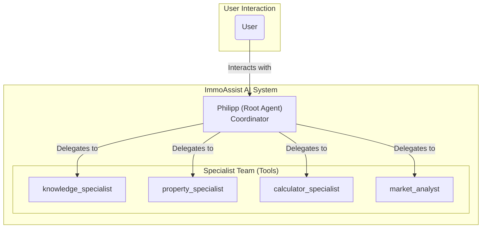

# ImmoAssist: AI-Powered Real Estate Investment Advisor

[](https://opensource.org/licenses/Apache-2.0)
[](https://www.python.org/downloads/)
[](https://google.github.io/adk-docs/)
[](https://github.com/immoassist)

An enterprise-grade, multi-agent AI system for 24/7 real estate investment consulting in Germany. Built with Google's Agent Development Kit (ADK), this project provides expert advice on German new-build properties.

## 🏛️ Architecture Overview

The system is designed as a **Multi-Agent System**, where a central coordinating agent delegates tasks to a team of specialized agents. This architecture ensures separation of concerns, scalability, and maintainability.

- **`Philipp` (Root Agent):** The primary coordinator and the sole point of contact for the user. He manages the conversation, understands the user's intent, and delegates tasks to the appropriate specialist. He synthesizes the information from specialists and presents it as his own expert analysis.
- **Specialist Agents:** A team of agents, each with a specific domain of expertise:
  - `knowledge_specialist`: Handles legal terms, processes, and FAQs.
  - `property_specialist`: Searches for and evaluates properties.
  - `calculator_specialist`: Performs all financial calculations and explains financial terms (e.g., _Sonder-AfA_).
  - `market_analyst`: Provides market trends and strategic investment advice.



### Technology Stack

- **Framework**: Google Agent Development Kit (ADK) v1.5+
- **AI Models**: Gemini 2.5 Flash, Gemini 2.5 Pro
- **Platform**: Google Cloud Platform (europe-west1)
- **Web Server**: Uvicorn / FastAPI (via ADK)
- **Knowledge Base**: Internal `data` directory with FAQs and handbooks.

## 🚀 Getting Started

### Prerequisites

- Python 3.11 or higher
- A Google Cloud Project with the Vertex AI API enabled.
- Authenticated Google Cloud CLI.

### Installation & Setup

1.  **Clone the repository:**

    ```bash
    git clone https://github.com/your-org/immoassist.git
    cd immoassist
    ```

2.  **Create a virtual environment and install dependencies:**

    ```bash
    python -m venv venv
    source venv/bin/activate  # On Windows, use: venv\Scripts\activate
    pip install -r requirements.txt
    pip install -r requirements-dev.txt # For development tools
    ```

3.  **Configure your environment:**
    Set the `GOOGLE_CLOUD_PROJECT` environment variable. You can do this permanently in your system or create a `.env` file in the project root.

    ```
    GOOGLE_CLOUD_PROJECT="your-gcp-project-id"
    ```

    The application will load this automatically. For optional integrations (HeyGen, ElevenLabs), add their respective API keys to this file.

4.  **Authenticate with Google Cloud:**
    If you haven't already, log in with the gcloud CLI.
    ```bash
    gcloud auth application-default login
    ```

### Running the Agent

To run the application, simply execute the `run_agent.py` script:

```bash
python run_agent.py
```

This will start the web server. You can interact with your agent by navigating to:

**`http://localhost:8000`**

The web interface is provided by the Google Agent Development Kit.

## 🏗️ Project Structure

The project follows a clean, modular structure for easy maintenance and scalability.

```
immoassist/
├── app/                  # Main application package
│   ├── __init__.py       # Makes 'app' a package
│   ├── agent.py          # Core multi-agent system definition
│   ├── config.py         # Application configuration
│   ├── models/           # Pydantic data models
│   └── tools/            # Specialist tools (e.g., knowledge, property)
├── data/                 # Knowledge base for RAG
│   ├── FAQ/
│   └── Handbücher/
├── tests/                # Test suite
├── run_agent.py          # Simple application runner script
├── pyproject.toml        # Project metadata and dependencies
└── requirements.txt      # Production dependencies
```

## Code Quality & Development

This project adheres to high code quality standards.

- **Formatting**: Black and Ruff for consistent, clean code.
- **Type Hinting**: Fully type-hinted for clarity and static analysis.
- **Testing**: Pytest for unit and integration tests (framework in place).
- **SOLID Principles**: The architecture is designed following SOLID principles for robustness and scalability.

### Running Tests

The test framework is set up. To run tests:

```bash
pytest
```

(Note: Test cases need to be implemented.)

## 🌱 Future Architectural Enhancements

This project has a solid foundation. For future scaling and to incorporate more advanced patterns seen in flagship examples like `gemini-fullstack`, the following enhancements can be considered:

1.  **Agent-based Self-Correction (Critique & Refine Cycle):**

    - **Concept:** Introduce a "Critic Agent" that evaluates the output of specialist agents. If the quality is below a certain threshold (e.g., the information is incomplete or not well-explained), the critic can trigger a refinement loop, forcing the specialist agent to revise its work.
    - **Benefit:** Creates a self-improving system that ensures higher quality and more reliable responses without manual intervention.

2.  **Advanced Workflows (`SequentialAgent` & `LoopAgent`):**

    - **Concept:** For complex, multi-step user requests (e.g., "Find me a property in Berlin and generate a full investment proposal"), orchestrate the workflow using `SequentialAgent`. This allows chaining multiple specialists (e.g., `property_specialist` -> `calculator_specialist` -> report generation) in a predictable pipeline.
    - **Benefit:** De-clutters the root agent's logic and makes complex processes more robust and easier to debug.

3.  **Direct Agent-to-Agent (A2A) Communication:**

    - **Concept:** As the system grows, allow specialists to communicate directly with each other instead of routing everything through Philipp. For example, the `property_specialist`, after finding a suitable object, could directly query the `calculator_specialist` to get its ROI and then return the enriched data to Philipp.
    - **Benefit:** Reduces the load on the central coordinator, creates more dynamic and efficient interactions, and allows for more complex collaborative behaviors between agents.

4.  **Structured Outputs with Pydantic:**

    - **Concept:** For tools and agents that must return data in a reliable format (especially the `calculator_specialist`), define a Pydantic `output_schema`. This forces the LLM to return a validated JSON object.
    - **Benefit:** Greatly increases the system's robustness by eliminating errors from parsing unstructured text and ensuring data consistency.

5.  **Callbacks for Post-Processing:**
    - **Concept:** Implement `after_agent_callback` functions for tasks that need to happen after an agent runs, such as cleaning up the final text, standardizing formatting, or logging analytics data.
    - **Benefit:** Separates the core agent logic from "side-effect" tasks like formatting and logging, making the code cleaner.

---

**ImmoAssist** - Your trusted AI advisor for German real estate investments.
