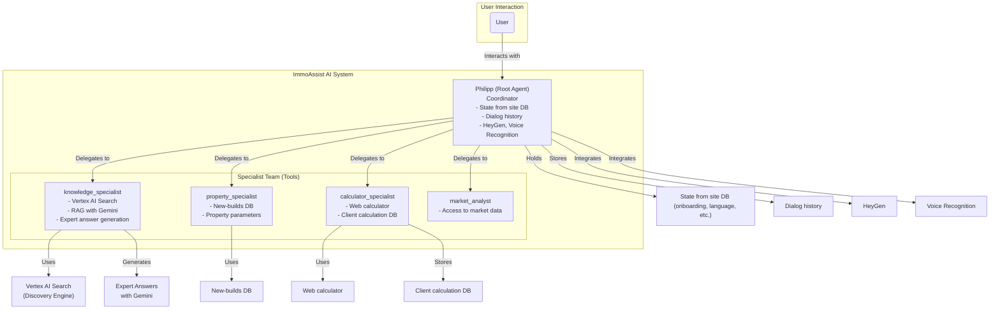

# ImmoAssist: AI-Powered Real Estate Investment Advisor

[](https://opensource.org/licenses/Apache-2.0)
[](https://www.python.org/downloads/)
[](https://google.github.io/adk-docs/)
[](https://github.com/immoassist)

An enterprise-grade, multi-agent AI system for 24/7 real estate investment consulting in Germany. Built with Google's Agent Development Kit (ADK), this project provides expert advice on German new-build properties with advanced AI-powered search and knowledge retrieval capabilities.

## Architecture Overview

Extended architecture of ImmoAssist with agents, tools, and integrations:



### Key Component Implementation

- **Vertex AI Search Integration**: Advanced document search using Google Cloud Discovery Engine with semantic search capabilities across FAQ, handbooks, guides, and other knowledge materials. Supports both document retrieval and generative answer generation.
- **RAG (Retrieval Augmented Generation)**: Combines Vertex AI Search with Gemini models to generate expert, contextual answers in the user's language with proper source attribution.
- **Multi-language Support**: Automatic language detection and response generation in German, English, and Russian with seamless cross-language knowledge retrieval.
- **Calculator**: The same calculator as on the website is used. All calculations per client are stored in a dedicated DB for analytics and personalization.
- **New-builds DB**: All properties and their parameters are stored in a centralized DB, accessible to the property_specialist.
- **Root agent state**: All user data (language, onboarding results, etc.) is stored in the site DB and available to the root agent for personalized dialog.
- **Dialog history**: All user interactions are stored for personalization and analytics.
- **HeyGen & Voice Recognition**: Integration with HeyGen for avatar video generation and with a speech recognition service for voice input/output.

## Technology Stack

- **Programming Language**: Python 3.11+
- **Framework**: Google Agent Development Kit (ADK)
- **Web Server**: Uvicorn / FastAPI (via ADK)
- **Frontend**: (Planned) React/TypeScript (see gemini-fullstack inspiration)
- **AI Search**: Google Cloud Vertex AI Search (Discovery Engine) for semantic document search
- **AI Models**: Google Gemini 2.5 Flash/Pro for answer generation and agent reasoning
- **Vector Database**: Google Cloud Vertex AI Matching Engine (for semantic search)
- **Relational Database**: (Planned) PostgreSQL or Google Cloud SQL (for user state, calculations, property data)
- **Authentication**: Google Cloud IAM, OAuth2 (planned)
- **Voice & Avatar Integration**: HeyGen API, Speech-to-Text API (Google or other)
- **Testing**: Pytest
- **Code Quality**: Black, Ruff
- **Dependency Management**: requirements.txt (current), **Poetry** (recommended for future)
- **CI/CD**: GitHub Actions (planned)
- **Cloud Infrastructure**: Google Cloud Platform (GCP), Docker (future)
- **Monitoring/Logging**: Google Cloud Logging, Sentry (future)
- **ML Training Pipeline**: (Planned) Vertex AI Pipelines or custom MLflow pipeline for fine-tuning and retraining models

## AI Search Features

### Vertex AI Search Integration

The system now includes comprehensive integration with Google Cloud Vertex AI Search (Discovery Engine) for advanced knowledge retrieval:

- **Semantic Search**: Intelligent document search across all knowledge materials using natural language queries
- **Multi-modal Support**: Search across various document types including PDFs, text files, and structured data
- **Contextual Retrieval**: Returns relevant document chunks with proper metadata and source attribution
- **Answer Generation**: Optional generative answer mode that creates comprehensive responses based on retrieved documents
- **Session Management**: Support for conversation context and follow-up queries
- **Query Expansion**: Automatic query enhancement for better search results
- **Spell Correction**: Built-in spelling correction for improved user experience

### RAG (Retrieval Augmented Generation)

The knowledge specialist implements a sophisticated RAG pipeline:

- **Document Retrieval**: Uses Vertex AI Search to find relevant documents from the knowledge base
- **Answer Synthesis**: Leverages Gemini models to generate expert, contextual answers
- **Source Attribution**: Provides proper citations and links to source materials
- **Language Adaptation**: Automatically responds in the user's preferred language
- **Quality Assurance**: Ensures answers are based on authoritative sources and current information

### Knowledge Base Management

- **Structured Content**: Organized knowledge base with FAQ, handbooks, guides, and regulatory documents
- **Automatic Indexing**: Documents are automatically processed and indexed for search
- **Version Control**: Support for document versioning and updates
- **Access Control**: Secure access to sensitive information through Google Cloud IAM

## Getting Started

### Prerequisites

- Python 3.11 or higher
- A Google Cloud Project with the Vertex AI API and Discovery Engine API enabled
- Authenticated Google Cloud CLI
- Service account with appropriate permissions for Vertex AI Search

### Installation & Setup

1.  **Clone the repository:**

    ```bash
    git clone https://github.com/your-org/immoassist.git
    cd immoassist
    ```

2.  **Create a virtual environment and install dependencies:**

    ```bash
    python -m venv venv
    source venv/bin/activate  # On Windows, use: venv\Scripts\activate
    pip install -r requirements.txt
    pip install -r requirements-dev.txt # For development tools
    ```

3.  **Configure your environment:**
    Copy the environment template and configure your settings:

    ```bash
    cp environment.config.template .env
    ```

    Update the `.env` file with your configuration:

    ```
    GOOGLE_CLOUD_PROJECT="your-gcp-project-id"
    GOOGLE_CLOUD_LOCATION="europe-west1"
    GOOGLE_GENAI_USE_VERTEXAI=True
    MODEL_NAME="gemini-2.5-flash"
    ```

    For optional integrations (HeyGen, ElevenLabs), add their respective API keys to this file.

4.  **Set up Google Cloud services:**
    Enable required APIs and configure authentication:

    ```bash
    # Enable required APIs
    gcloud services enable aiplatform.googleapis.com
    gcloud services enable discoveryengine.googleapis.com
    gcloud services enable storage.googleapis.com

    # Authenticate with Google Cloud
    gcloud auth application-default login
    ```

5.  **Configure Vertex AI Search:**
    Set up your Discovery Engine search engine and upload your knowledge base documents through the Google Cloud Console or API.

### Running the Agent

To run the application, simply execute the `run_agent.py` script:

```bash
python run_agent.py
```

This will start the web server. You can interact with your agent by navigating to:

**`http://localhost:8000`**

The web interface is provided by the Google Agent Development Kit.

## Project Structure

The project follows a clean, modular structure for easy maintenance and scalability.

```
immoassist/
├── app/                  # Main application package
│   ├── __init__.py       # Makes 'app' a package
│   ├── agent.py          # Core multi-agent system definition
│   ├── config.py         # Application configuration
│   ├── models/           # Pydantic data models
│   └── tools/            # Specialist tools
│       ├── knowledge_tools.py    # RAG and knowledge search
│       ├── vertex_search.py      # Vertex AI Search integration
│       ├── property_tools.py     # Property search and analysis
│       └── integration_tools.py  # External API integrations
├── data/                 # Knowledge base for RAG
│   ├── FAQ/
│   └── Handbücher/
├── tests/                # Test suite
├── run_agent.py          # Simple application runner script
├── pyproject.toml        # Project metadata and dependencies
├── requirements.txt      # Production dependencies
└── environment.config.template  # Environment configuration template
```

## Configuration

### Environment Variables

The system uses a comprehensive configuration system with the following key variables:

- `GOOGLE_CLOUD_PROJECT`: Your Google Cloud project ID
- `GOOGLE_CLOUD_LOCATION`: GCP region (default: europe-west1)
- `GOOGLE_GENAI_USE_VERTEXAI`: Use Vertex AI instead of AI Studio (default: True)
- `MODEL_NAME`: Gemini model to use (default: gemini-2.5-flash)
- `RAG_CORPUS`: Optional Vertex AI RAG corpus for enhanced knowledge retrieval
- `HEYGEN_API_KEY`: Optional HeyGen API key for avatar generation
- `ELEVENLABS_API_KEY`: Optional ElevenLabs API key for voice synthesis

### Vertex AI Search Configuration

The Vertex AI Search integration is configured in `app/tools/vertex_search.py`:

- **Project ID**: Configured for your specific Google Cloud project
- **Engine ID**: Your Discovery Engine search engine identifier
- **Region**: GCP region for the Discovery Engine service
- **Service Account**: Authentication using Google Cloud service account credentials

## Code Quality & Development

This project adheres to high code quality standards.

- **Formatting**: Black and Ruff for consistent, clean code
- **Type Hinting**: Fully type-hinted for clarity and static analysis
- **Testing**: Pytest for unit and integration tests (framework in place)
- **SOLID Principles**: The architecture is designed following SOLID principles for robustness and scalability
- **Documentation**: Comprehensive docstrings and inline documentation
- **Error Handling**: Robust error handling with proper logging and user feedback

### Running Tests

The test framework is set up. To run tests:

```bash
pytest
```

(Note: Test cases need to be implemented.)

### Development Workflow

1. **Code Quality**: Run formatting and linting before commits

   ```bash
   black .
   ruff check .
   ```

2. **Type Checking**: Ensure type safety

   ```bash
   mypy app/
   ```

3. **Testing**: Run the test suite
   ```bash
   pytest tests/
   ```

## Security & Compliance

### Data Protection

- **Encryption**: All data is encrypted in transit and at rest using Google Cloud security features
- **Access Control**: Fine-grained IAM permissions for service accounts and users
- **Audit Logging**: Comprehensive logging for compliance and security monitoring
- **GDPR Compliance**: Built-in support for data privacy and user consent management

### Best Practices

- **Service Account Security**: Use dedicated service accounts with minimal required permissions
- **API Key Management**: Secure storage and rotation of API keys
- **Network Security**: VPC Service Controls for network isolation
- **Monitoring**: Real-time monitoring and alerting for security events

## Future Architectural Enhancements

This project has a solid foundation. For future scaling and to incorporate more advanced patterns seen in flagship examples like `gemini-fullstack`, the following enhancements can be considered:

1.  **Agent-based Self-Correction (Critique & Refine Cycle):**

    - **Concept:** Introduce a "Critic Agent" that evaluates the output of specialist agents. If the quality is below a certain threshold (e.g., the information is incomplete or not well-explained), the critic can trigger a refinement loop, forcing the specialist agent to revise its work.
    - **Benefit:** Creates a self-improving system that ensures higher quality and more reliable responses without manual intervention.

2.  **Advanced Workflows (`SequentialAgent` & `LoopAgent`):**

    - **Concept:** For complex, multi-step user requests (e.g., "Find me a property in Berlin and generate a full investment proposal"), orchestrate the workflow using `SequentialAgent`. This allows chaining multiple specialists (e.g., `property_specialist` -> `calculator_specialist` -> report generation) in a predictable pipeline.
    - **Benefit:** De-clutters the root agent's logic and makes complex processes more robust and easier to debug.

3.  **Direct Agent-to-Agent (A2A) Communication:**

    - **Concept:** As the system grows, allow specialists to communicate directly with each other instead of routing everything through Philipp. For example, the `property_specialist`, after finding a suitable object, could directly query the `calculator_specialist` to get its ROI and then return the enriched data to Philipp.
    - **Benefit:** Reduces the load on the central coordinator, creates more dynamic and efficient interactions, and allows for more complex collaborative behaviors between agents.

4.  **Structured Outputs with Pydantic:**

    - **Concept:** For tools and agents that must return data in a reliable format (especially the `calculator_specialist`), define a Pydantic `output_schema`. This forces the LLM to return a validated JSON object.
    - **Benefit:** Greatly increases the system's robustness by eliminating errors from parsing unstructured text and ensuring data consistency.

5.  **Callbacks for Post-Processing:**
    - **Concept:** Implement `after_agent_callback` functions for tasks that need to happen after an agent runs, such as cleaning up the final text, standardizing formatting, or logging analytics data.
    - **Benefit:** Separates the core agent logic from "side-effect" tasks like formatting and logging, making the code cleaner.

## Support & Contributing

### Getting Help

- **Documentation**: Comprehensive documentation is available in the project wiki
- **Issues**: Report bugs and feature requests through GitHub Issues
- **Discussions**: Join community discussions for questions and ideas

### Contributing

We welcome contributions from the community. Please see our contributing guidelines for:

- Code style and standards
- Testing requirements
- Pull request process
- Development setup

### License

This project is licensed under the Apache License 2.0. See the LICENSE file for details.

---

**ImmoAssist** - Your trusted AI advisor for German real estate investments with advanced AI-powered search and knowledge retrieval capabilities.
