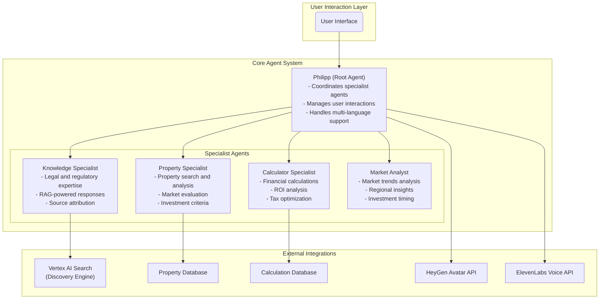

# ImmoAssist: AI-Powered Real Estate Investment Advisor

[](https://opensource.org/licenses/Apache-2.0)
[](https://www.python.org/downloads/)
[](https://google.github.io/adk-docs/)
[](https://github.com/immoassist)

Enterprise-grade multi-agent AI system for 24/7 real estate investment consulting in Germany. Built with Google's Agent Development Kit (ADK), this project provides expert advice on German new-build properties with advanced AI-powered search and knowledge retrieval capabilities.

## System Architecture

The ImmoAssist system implements a sophisticated multi-agent architecture with specialized components:



## Technology Stack

- **Core Framework**: Google Agent Development Kit (ADK) 1.5+
- **Programming Language**: Python 3.11+
- **AI Models**: Google Gemini 2.5 Flash/Pro
- **Search Engine**: Google Cloud Vertex AI Search (Discovery Engine)
- **Web Server**: Uvicorn/FastAPI (via ADK)
- **Data Validation**: Pydantic 2.10+
- **Configuration**: python-dotenv
- **HTTP Client**: requests, httpx
- **Authentication**: Google Cloud IAM

## Project Structure and File Documentation

### Core Application Files

#### `run_agent.py`

**Purpose**: Main entry point for the ImmoAssist agent system
**Functionality**:

- Initializes the ADK web interface
- Configures environment variables for Google Cloud services
- Starts the FastAPI server on port 8001
- Applies Windows Path compatibility patches
- Handles startup errors and provides diagnostic information

**Key Components**:

- Environment setup for Vertex AI and Google Cloud
- FastAPI application creation via ADK
- Server configuration with CORS support
- Error handling and user guidance

#### `app/__init__.py`

**Purpose**: Package initialization and system patches
**Functionality**:

- Defines package metadata and version information
- Applies Windows Path compatibility patch for Google ADK
- Resolves `WindowsPath.rstrip()` method compatibility issues
- Exports public API components

**Technical Details**:

- Monkeys patches `WindowsPath` class to support `rstrip()` method
- Ensures compatibility with Google ADK on Windows systems
- Provides version tracking and author information

### Configuration and Setup

#### `app/config.py`

**Purpose**: Centralized configuration management for the entire application
**Functionality**:

- Manages environment-specific settings
- Handles Google Cloud project configuration
- Controls feature flags and system behavior
- Validates production environment requirements

**Key Configuration Areas**:

- **AI Models**: Gemini model selection for different agent types
- **Google Cloud**: Project ID, location, and service configuration
- **RAG System**: Vertex AI Search engine configuration
- **Feature Flags**: Toggle for optional integrations (HeyGen, ElevenLabs)
- **Business Logic**: Financial calculation defaults and property search parameters
- **Logging**: Structured logging configuration and monitoring settings

**Environment Variables**:

- `GOOGLE_CLOUD_PROJECT`: Google Cloud project identifier
- `GOOGLE_CLOUD_LOCATION`: Geographic region for services
- `VERTEX_AI_ENGINE_ID`: Discovery Engine search engine ID
- `RAG_CORPUS`: Knowledge base corpus identifier
- `HEYGEN_API_KEY`: HeyGen avatar generation API key
- `ELEVENLABS_API_KEY`: ElevenLabs voice synthesis API key

### Agent System

#### `app/agent.py`

**Purpose**: Defines the multi-agent system architecture and specialist agents
**Functionality**:

- Implements four specialized agents with distinct responsibilities
- Configures agent coordination and tool delegation
- Manages multi-language support and response formatting
- Handles RAG response processing and source attribution

**Agent Definitions**:

**Knowledge Specialist** (`knowledge_specialist`):

- **Domain**: German real estate law, regulations, and ImmoAssist processes
- **Tools**: `search_knowledge_rag` for RAG-powered responses
- **Behavior**: Provides accurate, well-sourced information with proper citations
- **Output**: Structured `RagResponse` objects with source attribution

**Property Specialist** (`property_specialist`):

- **Domain**: Property search, evaluation, and market analysis
- **Tools**: `search_properties`, `get_property_details`
- **Focus**: A+ energy efficiency properties, new construction benefits
- **Range**: 250,000-500,000 EUR investment properties

**Calculator Specialist** (`calculator_specialist`):

- **Domain**: Financial calculations, ROI analysis, and investment optimization
- **Tools**: `calculate_investment_return`
- **Expertise**: German tax benefits, Sonder-AfA, cash flow analysis
- **Output**: Detailed financial projections and investment recommendations

**Market Analyst** (`market_analyst`):

- **Domain**: Market trends, regional analysis, and investment timing
- **Tools**: Market data analysis (to be implemented)
- **Focus**: Regional performance variations and growth projections
- **Output**: Strategic market insights and timing recommendations

**Root Agent** (`Philipp_ImmoAssist`):

- **Role**: Primary coordinator and user interface
- **Responsibilities**:
  - Delegates queries to appropriate specialists
  - Manages conversation flow and context
  - Provides unified responses in user's language
  - Coordinates multi-modal interactions (text, voice, avatar)
- **Tools**: All specialist agent tools plus integration tools

### Data Models

#### `app/models/output_schemas.py`

**Purpose**: Defines structured data models for type-safe communication between components
**Functionality**:

- Provides Pydantic models for all tool outputs
- Ensures data validation and type safety
- Defines consistent response formats across the system

**Key Model Categories**:

**Property Search Models**:

- `PropertySearchItem`: Individual property representation
- `PropertySearchResult`: Complete search results with metadata
- `PropertyDetails`: Comprehensive property information
- `PropertyDetailLocation`: Geographic and address information
- `PropertyDetailSpecs`: Physical property specifications
- `PropertyDetailFinancials`: Financial performance metrics

**Financial Calculation Models**:

- `CalculationSummary`: Basic financial overview
- `GermanTaxBenefits`: German-specific tax advantages
- `InvestmentRecommendation`: Investment analysis and recommendations
- `InvestmentCalculationResult`: Complete calculation output

**Knowledge Base Models**:

- `RagSource`: Source document metadata
- `RagResponse`: Complete RAG response with sources
- `KnowledgeSearchResult`: Knowledge base search results
- `ProcessGuide`: Step-by-step process documentation

**Integration Models**:

- `HeyGenResponse`: Avatar generation response
- `ElevenLabsResponse`: Voice synthesis response
- `AgentError`: Structured error reporting

### Tool Implementations

#### `app/tools/knowledge_tools.py`

**Purpose**: Implements RAG (Retrieval-Augmented Generation) capabilities for knowledge retrieval
**Functionality**:

- Provides intelligent search across knowledge base documents
- Generates contextual answers using Vertex AI Search
- Handles source attribution and citation management
- Supports multi-language response generation

**Key Features**:

- **Answer Endpoint**: Uses Vertex AI Search's generative answer capability
- **Search Endpoint**: Falls back to document retrieval for specific queries
- **Source Processing**: Extracts and validates source information
- **Error Handling**: Graceful degradation when services are unavailable
- **Content Prioritization**: Prioritizes extractive answers over snippets

**Output**: Structured `RagResponse` objects with answer text and source citations

#### `app/tools/vertex_search.py`

**Purpose**: Direct integration with Google Cloud Vertex AI Search (Discovery Engine)
**Functionality**:

- Manages authentication and API communication
- Handles both search and answer generation endpoints
- Processes search results and extracts relevant content
- Provides session management for conversation context

**Key Components**:

- **Authentication**: Service account credential management
- **Search Endpoint**: Document retrieval with query expansion
- **Answer Endpoint**: Generative answer creation with citations
- **Result Processing**: Content extraction from multiple sources
- **Error Handling**: Comprehensive error management and logging

**Configuration**:

- Project ID and engine ID from environment variables
- Geographic region specification for optimal performance
- Service account file path for authentication

#### `app/tools/property_tools.py`

**Purpose**: Property search and analysis capabilities
**Functionality**:

- Searches available properties based on user criteria
- Retrieves detailed property information
- Analyzes investment potential and market positioning
- Provides property comparison and evaluation

**Tools**:

- `search_properties`: Property discovery with filtering
- `get_property_details`: Comprehensive property information retrieval

**Note**: Implementation details would be in the actual file (not shown in current structure)

#### `app/tools/integration_tools.py`

**Purpose**: External service integrations for enhanced user experience
**Functionality**:

- HeyGen avatar generation for visual interactions
- ElevenLabs voice synthesis for audio responses
- API management and response processing
- Error handling for external service failures

**Integrations**:

- **HeyGen**: Avatar video generation with personalized messaging
- **ElevenLabs**: High-quality voice synthesis in multiple languages

### System Services

#### `app/services/session_service.py`

**Purpose**: Manages user session state and conversation history
**Functionality**:

- Tracks user interactions and preferences
- Maintains conversation context across sessions
- Stores user-specific data for personalization
- Manages session timeouts and cleanup

**Features**:

- Session persistence and recovery
- User preference storage
- Conversation history management
- Multi-session support

#### `app/logging_config.py`

**Purpose**: Comprehensive logging configuration for system monitoring
**Functionality**:

- Configures structured logging for production environments
- Implements log rotation and archival
- Provides performance monitoring capabilities
- Enables error tracking and debugging

**Components**:

- **StructuredFormatter**: JSON-based log formatting
- **AgentContextFilter**: Adds agent context to log records
- **Log Handlers**: Console, file, and error-specific handlers
- **Performance Logging**: Agent performance and user interaction tracking

**Features**:

- Environment-specific logging configuration
- Rotating file handlers with size limits
- Structured JSON output for log aggregation
- Agent context and session tracking

### Development and Testing

#### `requirements.txt`

**Purpose**: Production dependency specification
**Contents**:

- Google ADK and AI platform dependencies
- Core application libraries (Pydantic, requests, httpx)
- Google Cloud service libraries
- Optional integration dependencies (commented)

#### `requirements-dev.txt`

**Purpose**: Development and testing dependencies
**Contents**:

- Testing frameworks (pytest, pytest-asyncio)
- Code quality tools (black, ruff, mypy)
- Development utilities and debugging tools

#### `test_types.py`

**Purpose**: Type validation and testing utilities
**Functionality**:

- Validates Pydantic model definitions
- Tests data serialization and deserialization
- Ensures type safety across the system

### Configuration Templates

#### `environment.config.template`

**Purpose**: Template for environment configuration
**Contents**:

- Required environment variables
- Optional integration settings
- Google Cloud configuration examples
- Feature flag documentation

### Documentation

#### `DEVELOPMENT.md`

**Purpose**: Development guidelines and best practices
**Contents**:

- Code style and formatting standards
- Testing procedures and requirements
- Deployment and release processes
- Contribution guidelines

#### `INTEGRATION_PATTERNS.md`

**Purpose**: Integration architecture and patterns
**Contents**:

- External service integration guidelines
- API design patterns
- Error handling strategies
- Performance optimization techniques

#### `SECURITY.md`

**Purpose**: Security considerations and best practices
**Contents**:

- Authentication and authorization
- Data protection and privacy
- API security guidelines
- Vulnerability management

## Getting Started

### Prerequisites

- Python 3.11 or higher
- Google Cloud Project with Vertex AI API enabled
- Vertex AI Search (Discovery Engine) configured
- Authenticated Google Cloud CLI
- Service account with appropriate permissions

### Installation

1. **Clone the repository**:

   ```bash
   git clone https://github.com/your-org/immoassist.git
   cd immoassist
   ```

2. **Create virtual environment**:

   ```bash
   python -m venv venv
   source venv/bin/activate  # Windows: venv\Scripts\activate
   ```

3. **Install dependencies**:

   ```bash
    pip install -r requirements.txt
   pip install -r requirements-dev.txt  # For development
   ```

4. **Configure environment**:

   ```bash
   cp environment.config.template .env
   # Edit .env with your configuration
   ```

5. **Set up Google Cloud**:
   ```bash
   gcloud services enable aiplatform.googleapis.com
   gcloud services enable discoveryengine.googleapis.com
   gcloud auth application-default login
   ```

### Running the System

Start the agent system:

```bash
python run_agent.py
```

Access the web interface at `http://localhost:8001`

### Development

Run tests:

```bash
pytest tests/
```

Format code:

```bash
black app/ tests/
ruff check app/ tests/
```

## System Capabilities

### Multi-Agent Coordination

- Specialized agents for different domains
- Intelligent query delegation
- Unified response generation
- Context preservation across interactions

### Knowledge Management

- RAG-powered knowledge retrieval
- Source attribution and citations
- Multi-language knowledge access
- Real-time knowledge base updates

### Financial Analysis

- Comprehensive investment calculations
- German tax benefit optimization
- ROI analysis and projections
- Risk assessment and recommendations

### Property Search

- Advanced property filtering
- Market analysis and comparison
- Investment criteria matching
- Location and neighborhood evaluation

### Multi-Modal Interaction

- Text-based conversations
- Voice synthesis and recognition
- Avatar-based interactions
- Multi-language support

## License

Apache License 2.0 - see LICENSE file for details.

## Support

For technical support and questions, please refer to the development documentation or contact the development team.
