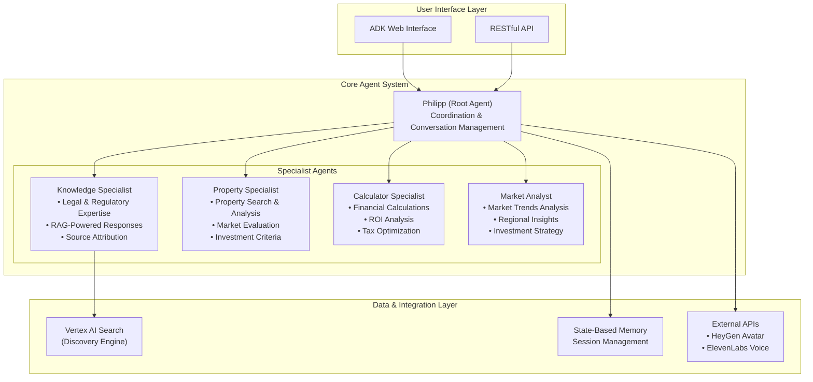

# ImmoAssist: AI-Powered German Real Estate Investment Advisor

[](https://opensource.org/licenses/Apache-2.0)
[](https://www.python.org/downloads/)
[](https://google.github.io/adk-docs/)

Enterprise-grade multi-agent AI system designed for professional real estate investment consulting in Germany. Built on Google's Agent Development Kit (ADK), this system provides expert analysis, property search, financial calculations, and knowledge retrieval through specialized AI agents.

## System Architecture

ImmoAssist implements a sophisticated multi-agent architecture with specialized domain experts:



## Technology Stack

- **Core Framework**: Google Agent Development Kit (ADK) 1.5+
- **Programming Language**: Python 3.11+
- **AI Models**: Google Gemini 2.5 Flash/Pro (configurable via environment)
- **Search & RAG**: Google Cloud Vertex AI Search (Discovery Engine)
- **Web Framework**: FastAPI (via ADK)
- **Data Validation**: Pydantic 2.10+
- **Async Runtime**: Uvicorn
- **Configuration**: python-dotenv
- **Retrieval**: llama-index 0.11+
- **Authentication**: Google Cloud Application Default Credentials

## Project Structure

```
immoassist/
├── app/                          # Core application package
│   ├── agent.py                  # Multi-agent system definition
│   ├── config.py                 # Environment configuration management
│   ├── models/                   # Pydantic data models
│   │   ├── output_schemas.py     # Tool output schemas
│   │   ├── property.py           # Property domain models
│   │   ├── financial.py          # Financial calculation models
│   │   └── user.py               # User interaction models
│   ├── prompts/                  # Agent prompt definitions
│   │   ├── root_agent.py         # Main coordinator prompts
│   │   ├── knowledge_specialist.py # RAG specialist prompts
│   │   ├── property_specialist.py  # Property search prompts
│   │   ├── calculator_specialist.py # Financial analysis prompts
│   │   └── market_analyst.py     # Market analysis prompts
│   ├── tools/                    # Agent tool implementations
│   │   ├── knowledge_tools.py    # RAG search tools
│   │   ├── property_tools.py     # Property search & analysis
│   │   ├── conversation_tools.py # Conversation analysis
│   │   ├── memory_tools.py       # Session memory management
│   │   ├── integration_tools.py  # External API integrations
│   │   └── vertex_search.py      # Vertex AI Search client
│   ├── services/                 # Business logic services
│   │   └── session_service.py    # User session management
│   └── shared_libraries/         # Shared components
│       ├── conversation_callbacks.py # ADK conversation callbacks
│       └── conversation_constants.py # State management constants
├── tests/                        # Test suite
│   └── test_conversation_flow.py # Conversation flow testing
├── run_agent.py                  # Application entry point
├── requirements.txt              # Production dependencies
├── requirements-dev.txt          # Development dependencies
├── pyproject.toml               # Project configuration & tools
├── Dockerfile                   # Container deployment
├── environment.config.template  # Environment configuration template
├── INTEGRATION_PATTERNS.md     # Integration documentation
├── SECURITY.md                 # Security guidelines
└── CONVERSATION_IMPROVEMENTS.md # System enhancement documentation
```

## Core Components

### Multi-Agent System

**Root Agent (Philipp_ImmoAssist)**

- Central coordinator for all user interactions
- Manages conversation flow and context
- Delegates specialized queries to domain experts
- Provides unified responses with memory persistence

**Knowledge Specialist**

- Domain: German real estate law, regulations, ImmoAssist processes
- Tools: RAG-powered knowledge search with source attribution
- Output: Structured responses with document citations

**Property Specialist**

- Domain: Property search, evaluation, market analysis
- Tools: Property database search, detailed property analysis
- Focus: A+ energy efficiency properties, new construction benefits

**Calculator Specialist**

- Domain: Financial calculations, ROI analysis, investment optimization
- Tools: Comprehensive financial modeling with German tax considerations
- Output: Investment projections, tax benefit analysis, cash flow modeling

**Market Analyst**

- Domain: Market trends analysis, regional insights, investment strategy
- Tools: Market data analysis and trend identification
- Output: Strategic market intelligence and timing recommendations

### Data Models

**Property Models**

- `PropertySearchItem`: Individual property representation
- `PropertySearchResult`: Search results with metadata
- `PropertyDetails`: Comprehensive property information

**Financial Models**

- `InvestmentCalculationResult`: Complete financial analysis
- `GermanTaxBenefits`: Tax optimization calculations
- `InvestmentRecommendation`: Strategic investment advice

**Knowledge Models**

- `RagResponse`: Knowledge base responses with source attribution
- `RagSource`: Document metadata and citations

### Tool System

**Knowledge Tools**

- `search_knowledge_rag`: Intelligent knowledge base search using Vertex AI Search
- RAG-powered responses with source attribution
- Multi-language support for German and English content

**Property Tools**

- `search_properties`: Advanced property filtering and search
- `get_property_details`: Comprehensive property analysis
- `calculate_investment_return`: Financial modeling and ROI calculation

**Conversation Tools**

- `analyze_conversation_context`: Conversation flow analysis
- `memorize_conversation`: Session memory management
- `recall_conversation`: Context retrieval and personalization

**Integration Tools**

- `send_heygen_avatar_message`: Avatar-based interactions (optional)
- `generate_elevenlabs_audio`: Voice synthesis (optional)

### Configuration Management

Environment-driven configuration with support for:

- **Model Selection**: Configurable Gemini models for different agent types
- **Google Cloud**: Project ID, location, and service configuration
- **RAG System**: Vertex AI Search engine configuration
- **Feature Flags**: Optional integrations (HeyGen, ElevenLabs)
- **Security**: Authentication and access control settings

### Memory & Session Management

State-based conversation memory using ADK's `callback_context.state`:

- **Persistent Memory**: User preferences and conversation history
- **Context Awareness**: Dynamic conversation adaptation
- **Session Management**: Multi-user session handling
- **Conversation Callbacks**: Advanced conversation flow control

## Getting Started

### Prerequisites

- Python 3.11 or higher
- Google Cloud Project with enabled APIs:
  - Vertex AI API
  - Vertex AI Search (Discovery Engine) API
- Google Cloud CLI configured with Application Default Credentials
- Service account with appropriate IAM permissions

### Required Google Cloud APIs

```bash
gcloud services enable aiplatform.googleapis.com
gcloud services enable discoveryengine.googleapis.com
```

### Installation

1. **Clone the repository**:

   ```bash
   git clone https://github.com/your-org/immoassist.git
   cd immoassist
   ```

2. **Create virtual environment**:

   ```bash
   python -m venv venv
   source venv/bin/activate  # Windows: venv\Scripts\activate
   ```

3. **Install dependencies**:

   ```bash
   pip install -r requirements.txt
   pip install -r requirements-dev.txt  # For development
   ```

4. **Configure authentication**:

   ```bash
   gcloud auth application-default login
   ```

5. **Set up environment**:
   ```bash
   cp environment.config.template .env
   # Edit .env with your specific configuration
   ```

### Environment Configuration

Key environment variables (see `environment.config.template` for complete list):

```bash
# Google Cloud Configuration
GOOGLE_GENAI_USE_VERTEXAI=True
GOOGLE_CLOUD_LOCATION=europe-west3

# Model Configuration
MODEL_NAME=gemini-2.5-flash
SPECIALIST_MODEL=gemini-2.5-flash
CHAT_MODEL=gemini-2.5-flash

# RAG Configuration
RAG_CORPUS=projects/your-project/locations/your-location/ragCorpora/your-corpus

# Server Configuration
PORT=8000
DEBUG=True

# Feature Flags
ENABLE_AI_AVATAR=false
ENABLE_VOICE_SYNTHESIS=false
```

### Running the System

**Development Mode**:

```bash
python run_agent.py
```

**Production Mode**:

```bash
# Using Docker
docker build -t immoassist .
docker run -p 8000:8000 --env-file .env immoassist

# Direct deployment
PORT=8000 python run_agent.py
```

Access the web interface at `http://localhost:8000`

### Development

**Run tests**:

```bash
pytest tests/ -v
```

**Code formatting**:

```bash
black app/ tests/
ruff check app/ tests/
```

**Type checking**:

```bash
mypy app/
```

## Security Considerations

- **Authentication**: Uses Google Cloud Application Default Credentials
- **Authorization**: IAM-based access control for Google Cloud services
- **Data Protection**: All data processed within Google Cloud infrastructure
- **Network Security**: VPC Service Controls support for production deployments
- **Audit Logging**: Cloud Audit Logs integration for compliance

Refer to `SECURITY.md` for comprehensive security guidelines.

## Integration Patterns

ImmoAssist supports multiple integration patterns:

**ADK Web Interface**: Direct browser-based interaction
**RESTful API**: Programmatic access for web applications
**Webhook Integration**: Event-driven integrations
**Batch Processing**: Large-scale data processing capabilities

Refer to `INTEGRATION_PATTERNS.md` for detailed integration documentation.

## Testing

Comprehensive test suite covering:

- **Unit Tests**: Individual component testing
- **Integration Tests**: Multi-agent interaction testing
- **Conversation Flow Tests**: End-to-end conversation scenarios
- **Performance Tests**: Load and stress testing

## Deployment

### Cloud Run Deployment

```bash
# Build and deploy to Google Cloud Run
gcloud run deploy immoassist \
  --source . \
  --region europe-west3 \
  --allow-unauthenticated \
  --set-env-vars GOOGLE_GENAI_USE_VERTEXAI=True
```

### Kubernetes Deployment

```yaml
apiVersion: apps/v1
kind: Deployment
metadata:
  name: immoassist
spec:
  replicas: 3
  selector:
    matchLabels:
      app: immoassist
  template:
    metadata:
      labels:
        app: immoassist
    spec:
      containers:
        - name: immoassist
          image: gcr.io/your-project/immoassist:latest
          ports:
            - containerPort: 8000
          env:
            - name: GOOGLE_GENAI_USE_VERTEXAI
              value: 'True'
```

## Performance Optimization

- **Async Processing**: Fully asynchronous architecture
- **Connection Pooling**: Optimized HTTP client configuration
- **Caching**: Intelligent response caching for knowledge base queries
- **Load Balancing**: Horizontal scaling support
- **Resource Management**: Memory-efficient conversation state management

## Monitoring and Observability

- **Structured Logging**: JSON-formatted logs for aggregation
- **Performance Metrics**: Agent response time and accuracy tracking
- **Error Tracking**: Comprehensive error handling and reporting
- **Health Checks**: Built-in health monitoring endpoints

## Contributing

1. Fork the repository
2. Create a feature branch
3. Make your changes with appropriate tests
4. Ensure code passes all quality checks
5. Submit a pull request

## License

Apache License 2.0 - see `LICENSE` file for details.

## Support

For technical support, integration questions, or feature requests, please refer to the project documentation or contact the development team.

## Quick Start (Local Development)

Follow these steps to spin up ImmoAssist locally in less than five minutes.

```bash
# 1. Clone and enter repository
 git clone https://github.com/your-org/immoassist.git
 cd immoassist

# 2. Create and activate virtual environment
 python -m venv .venv
 source .venv/bin/activate  # Windows: .venv\Scripts\activate

# 3. Install runtime dependencies
 pip install -r requirements.txt

# 4. Configure environment variables
 cp environment.config.template .env
 # Adjust .env as needed (MODEL_NAME, GOOGLE_CLOUD_PROJECT, etc.)

# 5. Authenticate with Google Cloud (ADC)
 gcloud auth application-default login

# 6. Launch the agent (development mode)
 python run_agent.py

# 7. Open browser
 http://localhost:8000/dev-ui/?app=app
```

> Tip: use `make dev` (see `Makefile`) for an automated version of these steps.

## Contributing

We welcome contributions! To keep the project tidy and maintainable, please follow the guidelines below.

### Pull Requests

1. **Fork the repository** and create your branch from `main`.
2. **Write descriptive commits** (imperative mood, 72-char wrap).
3. **Run the full test suite** (`pytest -v`) and ensure zero regressions.
4. **Lint & format**: `ruff --fix` and `black .`.
5. **Type-check**: `mypy app/`.
6. **Update documentation** if you add or change public APIs.
7. **Open a draft PR** early for visibility; mark ready once CI passes.

### Branch Naming

```
<type>/<issue-id>-<short-description>
# Examples
feature/42-rag-pagination
fix/128-email-timeout
```

### Commit Conventional Types

- `feat`: New feature
- `fix`: Bug fix
- `docs`: Documentation only changes
- `chore`: Other minor changes (build, CI, etc.)

### Contributor License Agreement (CLA)

By submitting a pull request, you agree to license your contribution under the Apache 2.0 License.

Thank you for helping make ImmoAssist better!
