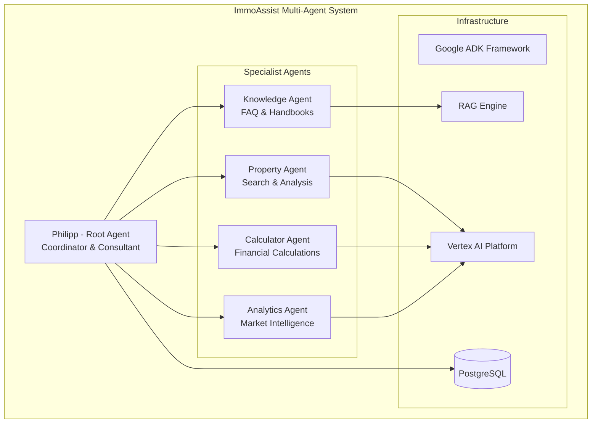

# ImmoAssist AI Agent

[](https://opensource.org/licenses/Apache-2.0)
[](https://www.python.org/downloads/)
[](https://google.github.io/adk-docs/)
[](https://github.com/psf/black)
[](https://github.com/astral-sh/ruff)

**Enterprise-grade AI agent for German real estate investment consulting, built with Google Agent Development Kit (ADK) and multi-agent architecture.**

## Overview

ImmoAssist is a specialized AI agent system that provides comprehensive consultation for investments in German new construction real estate. The system features a sophisticated multi-agent architecture with domain-specific specialists and enterprise-grade capabilities.

### Key Features

- **Multi-Agent Architecture**: Coordinated specialist agents for different domains
- **24/7 Consultation**: Automated real estate investment advisory
- **Financial Calculations**: Advanced ROI and cash flow analysis
- **Personalized Recommendations**: AI-driven property matching
- **Knowledge Base Integration**: Comprehensive FAQ and handbook system
- **Multi-Language Support**: German, English, and Russian interfaces

### Core Capabilities

- Real estate search and valuation
- Investment profitability calculations
- Tax optimization (5% special depreciation)
- User profile and preferences management
- Long-term and short-term memory
- FAQ and handbook integration

## Architecture



### Technology Stack

- **Framework**: Google Agent Development Kit (ADK) 1.5+
- **AI Platform**: Vertex AI with Gemini 2.5 Pro
- **Deployment**: Google Cloud Platform
- **Search**: Vertex AI RAG Engine
- **Database**: PostgreSQL for user data
- **Security**: Google Cloud IAM and authentication

## Quick Start

### Prerequisites

- Python 3.11 or higher
- Google Cloud Project with enabled APIs
- Poetry (recommended) or pip for dependency management

### Installation

1. **Clone the repository**

   ```bash
   git clone https://github.com/immoassist/immoassist-agent.git
   cd immoassist-agent
   ```

2. **Install dependencies**

   ```bash
   # Using Poetry (recommended)
   poetry install

   # Or using pip
   pip install -r requirements.txt
   ```

3. **Configure environment**

   ```bash
   # Copy environment template
   cp environment.config.template .env

   # Edit configuration
   nano .env
   ```

4. **Set up Google Cloud authentication**

   ```bash
   # Authenticate with Google Cloud
   gcloud auth application-default login
   gcloud auth application-default set-quota-project YOUR_PROJECT_ID

   # Enable required APIs
   gcloud services enable aiplatform.googleapis.com
   gcloud services enable storage.googleapis.com
   ```

### Running the Agent

#### Local Development

```bash
# Activate virtual environment
poetry shell

# Start the agent
adk web --port 8000
```

#### Web Interface

Open your browser and navigate to:

```
http://localhost:8000/dev-ui/?app=immoassist_agent
```

## Configuration

### Environment Variables

Create a `.env` file with the following configuration:

```bash
# Google Cloud Configuration
GOOGLE_CLOUD_PROJECT=your-project-id
GOOGLE_CLOUD_LOCATION=europe-west1
GOOGLE_GENAI_USE_VERTEXAI=True

# Model Configuration
MODEL_NAME=gemini-2.5-pro

# Optional: RAG Configuration
RAG_CORPUS=projects/your-project/locations/europe-west1/ragCorpora/your-corpus

# Server Configuration
PORT=8000
```

### Google Cloud Setup

1. **Create a Google Cloud Project**
2. **Enable required APIs**:
   - Vertex AI API
   - Cloud Storage API
   - Firestore API (optional)
3. **Set up authentication**:
   - Service account key or Application Default Credentials
4. **Configure IAM roles**:
   - `roles/aiplatform.user`
   - `roles/storage.objectViewer`

## Usage Examples

### Basic Consultation

```python
# Example interaction in German
user_input = "Ich suche eine 2-Zimmer-Wohnung in München für 300.000 Euro"

# Agent response includes:
# - Property search results
# - Financial analysis
# - Tax optimization recommendations
# - Next steps
```

### Investment Calculation

```python
# Request financial analysis
user_input = "Berechne die Rentabilität für diese Wohnung"

# Agent provides:
# - ROI calculations
# - Cash flow projections
# - Tax benefit analysis (5% Sonder-AfA)
# - Risk assessment
```

### Multi-Language Support

The agent automatically detects and responds in the user's language:

- **German**: Native-level consultation
- **Russian**: "Здравствуйте! Меня зовут Филипп..."
- **English**: "Hello! My name is Philipp..."

## Development

### Project Structure

```
immoassist/
├── immoassist_agent/           # Main agent package
│   ├── multi_agent_architecture.py  # Core multi-agent system
│   ├── a2a_agent_card.py      # A2A protocol support
│   ├── true_rag_agent.py      # RAG implementation
│   └── tools/                 # Agent tools
├── data/                      # Knowledge base
│   ├── FAQ/                   # Frequently asked questions
│   └── Handbücher/           # German real estate handbooks
├── tests/                     # Test suite
├── vector_store/              # Vector database
├── .env                       # Environment configuration
├── pyproject.toml             # Project configuration
└── requirements.txt           # Production dependencies
```

### Development Setup

```bash
# Install development dependencies
poetry install --with dev

# Install pre-commit hooks
pre-commit install

# Run tests
pytest

# Format code
black .
ruff check --fix .

# Type checking
mypy immoassist_agent/
```

### Code Quality Standards

- **Code Formatting**: Black with 88-character line length
- **Linting**: Ruff with comprehensive rule set
- **Type Checking**: mypy with strict configuration
- **Testing**: pytest with asyncio support
- **Pre-commit Hooks**: Automated code quality checks

## Deployment

### Local Development

```bash
# Start development server
adk web --host localhost --port 8000
```

### Google Cloud Run

```bash
# Build and deploy
gcloud run deploy immoassist-agent \
  --source . \
  --port=8080 \
  --allow-unauthenticated \
  --region=europe-west1 \
  --memory=2Gi \
  --cpu=1 \
  --min-instances=1 \
  --max-instances=10
```

### Vertex AI Agent Engine

```bash
# Package for Agent Engine
poetry build --format=wheel

# Deploy to Agent Engine
# (Refer to MULTI_AGENT_DEPLOYMENT_GUIDE.md for detailed instructions)
```

## Testing

### Unit Tests

```bash
# Run all tests
pytest

# Run with coverage
pytest --cov=immoassist_agent

# Run specific test categories
pytest -m unit
pytest -m integration
```

### Integration Tests

```bash
# Test with real Google Cloud services
pytest -m integration --env=staging
```

### Load Testing

```bash
# Performance testing with concurrent users
pytest tests/performance/ -v
```

## API Reference

### Multi-Agent System

- **Root Agent**: `Philipp_ImmoAssist_Coordinator`
- **Knowledge Agent**: `knowledge_specialist`
- **Property Agent**: `property_specialist`
- **Calculator Agent**: `calculator_specialist`
- **Analytics Agent**: `analytics_specialist`

### Core Functions

```python
from immoassist_agent import root_agent, create_immoassist_multi_agent_system

# Access the main agent
agent = root_agent

# Create new instance
new_agent = create_immoassist_multi_agent_system()
```

## Contributing

We welcome contributions from the international development community!

### Getting Started

1. Fork the repository
2. Create a feature branch (`git checkout -b feature/amazing-feature`)
3. Make your changes
4. Add tests for new functionality
5. Ensure all tests pass (`pytest`)
6. Format code (`black . && ruff check --fix .`)
7. Commit changes (`git commit -m 'Add amazing feature'`)
8. Push to branch (`git push origin feature/amazing-feature`)
9. Open a Pull Request

### Development Guidelines

- Follow existing code style and patterns
- Add comprehensive tests for new features
- Update documentation for API changes
- Use conventional commit messages
- Ensure backward compatibility

### Code Review Process

1. All changes require peer review
2. Automated tests must pass
3. Code coverage should not decrease
4. Documentation must be updated
5. Security considerations reviewed

## Roadmap

### Current Version (1.0.0)

- Multi-agent architecture
- Basic consultation functionality
- Knowledge base integration
- Financial calculations

### Upcoming Features

- Real database integration
- Enhanced RAG capabilities
- A2A inter-agent communication
- Mobile application support
- Advanced analytics dashboard

### Long-term Vision

- Multi-modal support (voice, images)
- Automated ML model training
- Enterprise CRM integration
- International market expansion

## Security

### Security Features

- Google Cloud IAM authentication
- Encrypted data transmission (HTTPS/TLS)
- Secure session management
- Input validation and sanitization
- Rate limiting and abuse protection

### Reporting Security Issues

For security concerns, please email: security@immoassist.de

Do not open public GitHub issues for security vulnerabilities.

## License

This project is licensed under the Apache License 2.0. See the [LICENSE](LICENSE) file for details.

## Support

### Documentation

- [API Documentation](https://docs.immoassist.de)
- [Deployment Guide](MULTI_AGENT_DEPLOYMENT_GUIDE.md)
- [ADK Documentation](https://google.github.io/adk-docs/)

### Community

- [GitHub Discussions](https://github.com/immoassist/immoassist-agent/discussions)
- [Issue Tracker](https://github.com/immoassist/immoassist-agent/issues)

### Professional Support

For enterprise support and consulting:

- Email: enterprise@immoassist.de
- Website: https://www.immoassist.de

---

**ImmoAssist** - Your intelligent partner for real estate investments in Germany

Built with Google ADK | Powered by Vertex AI | Made for International Teams
