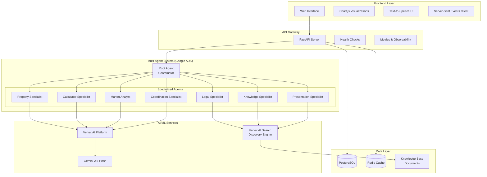

# ImmoAssist: AI-Powered German Real Estate Investment Platform

**Python Version** | **Google ADK** | **Gemini 2.5**

Профессиональная многоагентная AI-система для консультирования по инвестициям в немецкую недвижимость. Построена на Google Agent Development Kit (ADK) со специализированными доменными экспертами, продвинутой визуализацией данных и комплексной базой знаний на основе RAG.

## Архитектура системы

ImmoAssist реализует сложную оркестровку многоагентной системы со специализированными доменными экспертами и расширенными возможностями визуализации:



## Технологический стек

### Основной фреймворк

- **Google Agent Development Kit (ADK) 1.0.0** - Фреймворк для разработки многоагентных AI-систем
- **Python 3.12+** с архитектурой async/await
- **FastAPI** веб-фреймворк (через ADK)

### AI & ML

- **Google Gemini 2.5 Flash/Pro** модели
- **Vertex AI Search (Discovery Engine)** для RAG
- **Многоагентная оркестровка разговоров**

### Визуализация данных

- **Chart.js 4.4+** для динамического рендеринга графиков
- **Серверная генерация данных для графиков**
- **Конвейер визуализации данных в реальном времени**

### Инфраструктура

- **Google Cloud Platform** нативная интеграция
- **Vertex AI** для хостинга моделей
- **Cloud Run** для контейнерного развертывания
- **Poetry** для управления зависимостями Python

## Расширенные возможности

### Система визуализации данных

ImmoAssist включает сложный движок визуализации данных, который автоматически генерирует графики и диаграммы:

**Поддерживаемые типы графиков:**

- Линейные графики для анализа трендов (прогрессия доходности, рыночные тренды)
- Столбчатые графики для сравнительного анализа (сравнения городов, разделение затрат)
- Круговые диаграммы для анализа распределения (распределение расходов, инвестиционный портфель)

**Рабочий процесс визуализации:**

1. Агент анализирует запрос пользователя на требования к визуализации
2. Инструмент `create_chart()` генерирует структурированные данные графика
3. Frontend рендерер Chart.js создает интерактивные визуализации
4. Обновления графиков в реальном времени во время разговора

**Пример использования:**

```python
# Агент автоматически определяет потребности в визуализации
create_chart(
    chart_type="line",
    data=[{"year": 2024, "yield": 3.5}, {"year": 2025, "yield": 3.7}],
    title="5-летний прогноз доходности",
    x_label="Год",
    y_label="Доходность (%)"
)
```

### Многоагентная оркестровка

**Root Agent (Координатор):**

- Основной координатор разговора
- Интеллектуальная маршрутизация запросов к специалистам
- Синтез ответов и координация визуализации
- Многоязычная поддержка (немецкий, английский, русский)

**Специализированные агенты:**

- **Knowledge Specialist**: Извлечение общих знаний на основе RAG
- **Property Specialist**: Поиск недвижимости и анализ рынка
- **Calculator Specialist**: Финансовые расчеты и инвестиционное моделирование
- **Market Analyst**: Анализ трендов и стратегические инсайты
- **Legal Specialist**: Экспертиза по немецкому праву недвижимости
- **Presentation Specialist**: Образовательный контент и материалы курсов
- **Coordination Specialist**: Разрешение сложных многодоменных запросов

### База знаний на основе RAG

**Множественные источники знаний:**

- Корпус общих знаний о недвижимости
- Немецкие правовые документы и нормативные акты
- Образовательные презентационные материалы
- Данные и отчеты анализа рынка

**Расширенные функции RAG:**

- Атрибуция источников и цитирование
- Многоязычная обработка документов
- Контекстно-зависимое извлечение знаний
- Обновления базы знаний в реальном времени

## Структура проекта

```
immoassist/
├── app/                          # Основное приложение
│   ├── agent.py                  # Определение многоагентной системы
│   ├── config.py                 # Управление конфигурацией
│   ├── health_checks.py          # Проверки состояния системы
│   ├── observability.py          # Мониторинг и метрики
│   ├── models/                   # Модели данных
│   │   ├── financial.py          # Модели финансовых расчетов
│   │   ├── property.py           # Доменные модели недвижимости
│   │   ├── user.py              # Модели пользователей
│   │   └── output_schemas.py     # Схемы вывода инструментов
│   ├── prompts/                  # Инструкции агентов
│   │   ├── root_agent_focused.py           # Промпты главного координатора
│   │   ├── calculator_specialist_focused.py # Промпты финансового анализа
│   │   ├── knowledge_specialist_focused.py  # Промпты RAG специалиста
│   │   ├── legal_specialist_focused.py     # Промпты правовой экспертизы
│   │   ├── presentation_specialist_focused.py # Промпты контента курсов
│   │   ├── property_specialist_focused.py  # Промпты специалиста по недвижимости
│   │   ├── market_analyst_focused.py       # Промпты рыночного аналитика
│   │   ├── coordination_specialist_focused.py # Промпты координации
│   │   ├── base_system_prompt.py          # Базовые системные промпты
│   │   ├── conversation_management.py     # Управление разговорами
│   │   ├── conversation_prompts.py        # Промпты разговоров
│   │   ├── coordination_rules.py          # Правила координации
│   │   └── prompt_composer.py             # Композитор промптов
│   ├── tools/                    # Возможности агентов
│   │   ├── chart_tools.py        # Инструменты визуализации данных
│   │   ├── knowledge_tools.py    # Реализации RAG поиска
│   │   ├── property_tools.py     # Поиск и анализ недвижимости
│   │   ├── conversation_tools.py # Анализ контекста
│   │   ├── memory_tools.py       # Управление сессиями
│   │   ├── integration_tools.py  # Интеграции внешних API
│   │   ├── legal_tools.py        # Правовые инструменты
│   │   ├── presentation_tools.py # Инструменты презентаций
│   │   ├── datetime_tools.py     # Инструменты работы с датой/временем
│   │   └── vertex_search.py      # Обертка Vertex AI Search
│   ├── services/                 # Бизнес-логика
│   │   └── session_service.py    # Управление сессиями
│   └── shared_libraries/         # Общие утилиты
│       ├── conversation_callbacks.py # Колбэки разговоров
│       ├── conversation_constants.py # Константы разговоров
│       ├── combined_callbacks.py     # Объединенные колбэки
│       └── datetime_callback.py      # Колбэки даты/времени
├── frontend/                     # Веб-интерфейс
│   ├── index.html               # Основной UI приложения
│   ├── script.js                # Основная логика приложения
│   ├── chartRenderer.js         # Движок визуализации Chart.js
│   ├── agentClient.js           # Клиент агентов
│   ├── apiClient.js             # HTTP клиент для API
│   ├── chatUI.js                # Интерфейс чата
│   ├── speechManager.js         # Менеджер речи
│   ├── voiceChat.js             # Голосовой чат
│   ├── languageManager.js       # Менеджер языков
│   ├── style.css                # Стили приложения
│   └── chart.min.js             # Библиотека Chart.js
├── tests/                       # Тестовый набор
│   ├── test_conversation_flow.py # Тесты потока разговора
│   └── README.md                # Документация тестирования
├── run_agent.py                 # Точка входа приложения
├── pyproject.toml              # Конфигурация Poetry и зависимости
├── test_agent_selection.py     # Тесты выбора агентов
├── test_datetime.py            # Тесты даты/времени
├── validation_script.py        # Скрипт валидации
└── Dockerfile                  # Конфигурация контейнера
```

## Установка и настройка

### Предварительные требования

**Обязательно:**

- Python 3.11+
- Проект Google Cloud с включенными API
- Google Cloud CLI с Application Default Credentials
- Poetry для управления зависимостями

**Google Cloud API:**

```bash
gcloud services enable aiplatform.googleapis.com
gcloud services enable discoveryengine.googleapis.com
```

### Быстрый старт

```bash
# 1. Клонирование репозитория
git clone https://github.com/your-org/immoassist.git
cd immoassist

# 2. Создание виртуального окружения (обязательно)
python -m venv venv

# 3. Активация виртуального окружения
# На Windows:
venv\Scripts\activate
# На Linux/macOS:
source venv/bin/activate

# 4. Установка Poetry в виртуальном окружении
pip install poetry

# 5. Установка зависимостей через Poetry
poetry install

# 6. Настройка аутентификации Google Cloud
gcloud auth application-default login

# 7. Настройка окружения
cp .env.example .env
# Отредактируйте .env с вашей конфигурацией

# 8. Запуск приложения
python run_agent.py

# 9. Доступ к интерфейсу
# http://localhost:8000
```

**Важно:** Все Python зависимости должны быть установлены в виртуальном окружении (venv). Установка пакетов глобально не поддерживается.

### Настройка Vertex AI

#### Включение API

Для работы системы необходимо включить следующие API в Google Cloud Console:

```bash
# Включение Vertex AI API
gcloud services enable aiplatform.googleapis.com

# Включение Discovery Engine API для RAG
gcloud services enable discoveryengine.googleapis.com
```

Альтернативно, API можно включить через [консоль Google Cloud](https://cloud.google.com/vertex-ai/docs/featurestore/setup).

#### Настройка IAM ролей

Для корректной работы системы необходимо настроить следующие IAM роли:

**Обязательные роли:**

- `Vertex AI User` - для использования моделей и API
- `Vertex AI Administrator` - для управления ресурсами
- `Cloud Run Invoker` - для развертывания на Cloud Run
- `Discovery Engine Admin` - для управления RAG корпусами
- `Storage Object Admin` - для работы с Cloud Storage бакетами

**Дополнительные роли для сервисного аккаунта:**

- `Service Account User` - для использования сервисных аккаунтов
- `Cloud Storage Admin` - для полного доступа к хранилищу

#### Настройка RAG корпусов

Система использует Vertex AI RAG Engine для работы с базой знаний. Необходимо создать следующие RAG корпусы через [консоль Vertex AI RAG](https://console.cloud.google.com/vertex-ai/rag/):

**1. Основной корпус знаний**

- Назначение: Общие знания о недвижимости, FAQ, справочная информация
- Тип: Document Corpus
- Источники: PDF-файлы, документация, справочники

**2. Юридический корпус**

- Назначение: Немецкое законодательство по недвижимости
- Тип: Document Corpus
- Источники:
  - [Einkommensteuergesetz (EStG)](https://www.gesetze-im-internet.de/estg/)
  - [Bürgerliches Gesetzbuch (BGB)](https://www.gesetze-im-internet.de/bgb/)
  - [Gewerbeordnung (GewO) §34c](https://www.gesetze-im-internet.de/gewo_34cdv/)

**3. Презентационный корпус**

- Назначение: Образовательные материалы, курсы, презентации
- Тип: Document Corpus
- Источники: Учебные материалы, курс чтобы агент мог искать там информацию по курсу

#### Создание RAG корпуса

```bash
# Создание корпуса через REST API
curl -X POST \
     -H "Authorization: Bearer $(gcloud auth print-access-token)" \
     -H "Content-Type: application/json; charset=utf-8" \
     -d '{
       "display_name": "Immobilien Knowledge Base",
       "description": "Корпус знаний для немецкой недвижимости"
     }' \
     "https://europe-west3-aiplatform.googleapis.com/v1beta1/projects/YOUR_PROJECT_ID/locations/europe-west3/ragCorpora"
```

#### Загрузка документов в RAG корпус

**Через Cloud Storage:**

```bash
# Импорт документов из Cloud Storage
curl -X POST \
     -H "Authorization: Bearer $(gcloud auth print-access-token)" \
     -H "Content-Type: application/json; charset=utf-8" \
     -d '{
       "import_rag_files_config": {
         "gcs_source": {
           "uris": ["gs://your-bucket/documents/"]
         },
         "rag_file_chunking_config": {
           "chunk_size": 1024,
           "chunk_overlap": 100
         }
       }
     }' \
     "https://europe-west3-aiplatform.googleapis.com/v1beta1/projects/YOUR_PROJECT_ID/locations/europe-west3/ragCorpora/RAG_CORPUS_ID/ragFiles:import"
```

**Через прямую загрузку:**

```bash
# Загрузка отдельного файла
curl -X POST \
    -H "X-Goog-Upload-Protocol: multipart" \
    -H "Authorization: Bearer $(gcloud auth print-access-token)" \
    -F metadata='{"rag_file": {"display_name": "Документ", "description": "Описание"}}' \
    -F file=@/path/to/document.pdf \
    "https://europe-west3-aiplatform.googleapis.com/upload/v1beta1/projects/YOUR_PROJECT_ID/locations/europe-west3/ragCorpora/RAG_CORPUS_ID/ragFiles:upload"
```

#### Настройка Cloud Storage бакетов

Для хранения документов RAG корпусов рекомендуется создать структурированные Cloud Storage бакеты:

```bash
# Создание основного бакета для документов
gsutil mb -p your-project-id -c STANDARD -l europe-west3 gs://your-project-rag-documents

# Создание структуры папок
gsutil -m cp -r local-documents/* gs://your-project-rag-documents/knowledge-base/
gsutil -m cp -r legal-documents/* gs://your-project-rag-documents/legal/
gsutil -m cp -r presentations/* gs://your-project-rag-documents/presentations/
```

**Рекомендуемая структура бакета:**

```
gs://your-project-rag-documents/
├── knowledge-base/
│   ├── faq/
│   ├── handbooks/
│   └── general/
├── legal/
│   ├── estg/
│   ├── bgb/
│   └── gewo/
└── presentations/
    ├── courses/
    └── materials/
```

#### Автоматическая векторизация

RAG корпусы автоматически векторизируют загруженные документы с использованием модели `text-embedding-005`. Дополнительная настройка векторизации не требуется.

**Поддерживаемые форматы документов:**

- PDF (.pdf)
- Microsoft Word (.docx, .doc)
- Текстовые файлы (.txt)
- HTML (.html, .htm)
- Markdown (.md)

**Параметры:**

- `chunk_size`: 1024 токена (рекомендуется для большинства документов)
- `chunk_overlap`: 100 токенов (обеспечивает связность между чанками)

### Конфигурация окружения

Ключевые переменные окружения:

```bash
# Конфигурация Google Cloud
GOOGLE_GENAI_USE_VERTEXAI=True
GOOGLE_CLOUD_PROJECT=your-project-id
GOOGLE_CLOUD_LOCATION=europe-west3

# Конфигурация моделей
MODEL_NAME=gemini-2.5-flash
SPECIALIST_MODEL=gemini-2.5-flash
CHAT_MODEL=gemini-2.5-flash

# Конфигурация RAG корпусов
# Основной корпус знаний
RAG_CORPUS=projects/your-project-id/locations/europe-west3/ragCorpora/CORPUS_ID_1

# Юридический корпус (законодательство)
LEGAL_RAG_CORPUS=projects/your-project-id/locations/europe-west3/ragCorpora/CORPUS_ID_2

# Презентационный корпус (образовательные материалы)
PRESENTATION_RAG_CORPUS=projects/your-project-id/locations/europe-west3/ragCorpora/CORPUS_ID_3

# Флаги функций
ENABLE_VOICE_SYNTHESIS=true
ENABLE_EMAIL_NOTIFICATIONS=true
ENABLE_CONVERSATION_HISTORY=true

# Конфигурация сервера
PORT=8000
DEBUG=false
```

**Получение ID RAG корпуса:**

После создания RAG корпуса через консоль или API, ID можно найти в деталях корпуса в формате:
`projects/your-project-id/locations/europe-west3/ragCorpora/NUMERIC_ID`

Пример: `projects/gothic-agility-464209-f4/locations/europe-west3/ragCorpora/2305843009213693952`

#### Управление RAG корпусами

**Просмотр существующих корпусов:**

```bash
# Список всех RAG корпусов
curl -X GET \
     -H "Authorization: Bearer $(gcloud auth print-access-token)" \
     "https://europe-west3-aiplatform.googleapis.com/v1beta1/projects/YOUR_PROJECT_ID/locations/europe-west3/ragCorpora"
```

**Получение информации о корпусе:**

```bash
# Детали конкретного корпуса
curl -X GET \
     -H "Authorization: Bearer $(gcloud auth print-access-token)" \
     "https://europe-west3-aiplatform.googleapis.com/v1beta1/projects/YOUR_PROJECT_ID/locations/europe-west3/ragCorpora/RAG_CORPUS_ID"
```

**Список файлов в корпусе:**

```bash
# Просмотр загруженных файлов
curl -X GET \
     -H "Authorization: Bearer $(gcloud auth print-access-token)" \
     "https://europe-west3-aiplatform.googleapis.com/v1beta1/projects/YOUR_PROJECT_ID/locations/europe-west3/ragCorpora/RAG_CORPUS_ID/ragFiles"
```

**Тестирование RAG поиска:**

```bash
# Тестовый запрос к RAG корпусу
curl -X POST \
     -H "Authorization: Bearer $(gcloud auth print-access-token)" \
     -H "Content-Type: application/json" \
     -d '{
       "vertex_rag_store": {
         "rag_resources": {
           "rag_corpus": "projects/YOUR_PROJECT_ID/locations/europe-west3/ragCorpora/RAG_CORPUS_ID"
         }
       },
       "query": {
         "text": "Как рассчитать налоги на недвижимость в Германии?",
         "similarity_top_k": 5
       }
     }' \
     "https://europe-west3-aiplatform.googleapis.com/v1beta1/projects/YOUR_PROJECT_ID/locations/europe-west3:retrieveContexts"
```

#### Мониторинг и оптимизация

**Метрики производительности:**

- Время ответа RAG запросов
- Количество обработанных документов
- Использование квот эмбеддинг модели
- Точность поиска по релевантности

**Рекомендации по оптимизации:**

- Регулярно обновляйте документы в корпусах
- Используйте соответствующие размеры чанков для разных типов документов
- Мониторьте качество поиска и корректируйте пороги релевантности
- Настройте гибридный поиск для улучшения точности

## Основные функции

### Финансовый анализ

- Расчеты оптимизации немецких налогов (Sonder-AfA, линейная амортизация)
- ROI-анализ с комплексным моделированием затрат
- Многолетние инвестиционные прогнозы
- Анализ денежного потока и расчеты доходности

### Аналитика недвижимости

- Расширенный поиск недвижимости с инвестиционными критериями
- Анализ рынка и выявление трендов
- Оценка локации и анализ района
- Оценка энергоэффективности (фокус на свойства A+)

### Правовая экспертиза

- Руководство по немецкому праву недвижимости (EStG, BGB, MaBV)
- Соответствие налоговым регламентам
- Анализ контрактов и нормативных актов
- Оптимизация инвестиционной структуры

### Образовательная поддержка

- Интерактивная доставка содержания курса
- Пошаговое руководство по инвестированию
- Персонализированные пути обучения
- Отслеживание прогресса и оценка

### Визуализация данных

- Автоматическая генерация графиков на основе контекста разговора
- Интерактивные финансовые прогнозы
- Визуализации рыночных трендов
- Диаграммы сравнения инвестиций

## API и интеграция

### ADK Web Interface

Прямое взаимодействие через браузер с полными возможностями агентов.

```bash
http://localhost:8000/dev-ui/?app=app
```

### RESTful API

```bash
# Начать разговор
POST /apps/app/users/{user_id}/sessions/{session_id}

# Отправить сообщение
POST /run_sse
Content-Type: application/json
{
  "message": "Покажите мне прогнозы доходности для объектов в Лейпциге"
}

# Проверка здоровья
GET /health

# Text-to-Speech
POST /tts-stream
```

### Webhook интеграция

Интеграции на основе событий для внешних систем и рабочих процессов.

## Развертывание

### Локальная разработка

```bash
poetry run python run_agent.py
```

### Docker контейнер

```bash
docker build -t immoassist .
docker run -p 8000:8000 --env-file .env immoassist
```

### Google Cloud Run

```bash
gcloud run deploy immoassist \
  --source . \
  --region europe-west3 \
  --allow-unauthenticated \
  --set-env-vars GOOGLE_GENAI_USE_VERTEXAI=True
```

### Kubernetes

```yaml
apiVersion: apps/v1
kind: Deployment
metadata:
  name: immoassist
spec:
  replicas: 3
  selector:
    matchLabels:
      app: immoassist
  template:
    metadata:
      labels:
        app: immoassist
    spec:
      containers:
        - name: immoassist
          image: gcr.io/your-project/immoassist:latest
          ports:
            - containerPort: 8000
          env:
            - name: GOOGLE_GENAI_USE_VERTEXAI
              value: 'True'
```

## Тестирование

```bash
# Запуск тестового набора
poetry run pytest tests/ -v

# Качество кода
poetry run black app/ tests/
poetry run ruff check app/ tests/
poetry run mypy app/
```

## Производительность и масштабируемость

### Преимущества архитектуры:

- Async/await повсюду для высокой конкурентности
- Распределение нагрузки на основе агентов
- Интеллектуальная маршрутизация запросов и кэширование
- Поддержка горизонтального масштабирования

### Функции оптимизации:

- Пулы соединений для внешних API
- Кэширование ответов для запросов к базе знаний
- Эффективное управление памятью для разговоров
- Сбалансированная обработка агентов

## Безопасность

### Аутентификация и авторизация:

- Интеграция Google Cloud IAM
- Application Default Credentials
- Контроль доступа на основе служебных аккаунтов

### Защита данных:

- Вся обработка в рамках инфраструктуры Google Cloud
- Поддержка VPC Service Controls
- Интеграция журналирования аудита
- Безопасное управление состоянием разговора

## Мониторинг и наблюдаемость

### Журналирование:

- Структурированное JSON журналирование
- Отслеживание производительности агентов
- Отслеживание и оповещение об ошибках
- Анализ потока разговора

### Метрики:

- Мониторинг времени ответа
- Отслеживание использования агентов
- Производительность запросов к базе знаний
- Аналитика пользовательского взаимодействия

## Дорожная карта разработки

| Компонент                      | Статус              | Примечания                                         |
| ------------------------------ | ------------------- | -------------------------------------------------- |
| Основная многоагентная система | Готово к продакшену | 7 специализированных агентов с полной оркестровкой |
| Движок визуализации данных     | Готово к продакшену | Интеграция Chart.js с динамической генерацией      |
| RAG база знаний                | Готово к продакшену | Мультикорпусная интеграция Vertex AI Search        |
| Финансовые расчеты             | Готово к продакшену | Оптимизация немецких налогов и ROI-анализ          |
| Интеграция поиска недвижимости | В разработке        | Интеграция API недвижимости в процессе             |
| Синтез голоса                  | Бета                | Доступна интеграция ElevenLabs TTS                 |
| Email уведомления              | Бета                | Интеграция SMTP сервиса                            |
| Мобильное приложение           | Запланировано       | Планируется реализация React Native                |
| Переход на React               | Запланировано       | Миграция с Vanilla JS на React                     |

## Вклад в разработку

1. Создайте форк репозитория
2. Создайте feature ветку (`git checkout -b feature/your-feature`)
3. Зафиксируйте изменения (`git commit -am 'Add your feature'`)
4. Отправьте в ветку (`git push origin feature/your-feature`)
5. Создайте Pull Request

### Руководящие принципы разработки:

- Следуйте руководящим принципам стиля PEP 8
- Добавляйте комплексные тесты для новых функций
- Обновляйте документацию для изменений API
- Убедитесь, что все тесты проходят перед отправкой PR

## Поддержка и документация

Для технической поддержки, вопросов интеграции или запросов функций:

**Техническая документация:**

- API справочник: `/docs` эндпоинт при запуске
- Архитектура агентов: См. `app/agent.py`
- Руководство по конфигурации: См. `app/config.py`

**Поддержка интеграции:**

- Паттерны интеграции WebHook
- Разработка пользовательских агентов
- Руководство по корпоративному развертыванию

## Коммерческая лицензия

Это коммерческий программный продукт. Все права защищены. Несанкционированное воспроизведение, распространение или модификация запрещены.
