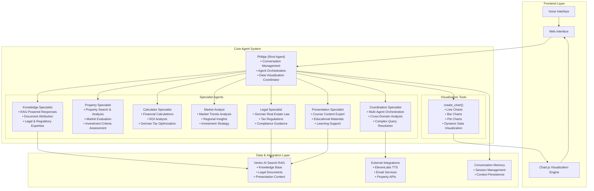

# ImmoAssist: AI-Powered German Real Estate Investment Platform

[](https://www.python.org/downloads/)
[](https://google.github.io/adk-docs/)
[](https://ai.google.dev/gemini-api)

Professional multi-agent AI system for German real estate investment consulting. Built on Google's Agent Development Kit (ADK) with specialized domain experts, advanced data visualization, and comprehensive RAG-powered knowledge base.

## System Architecture

ImmoAssist implements a sophisticated multi-agent orchestration with specialized domain experts and advanced visualization capabilities:



## Technology Stack

**Core Framework**

- Google Agent Development Kit (ADK) 1.5+
- Python 3.11+ with async/await architecture
- FastAPI web framework (via ADK)

**AI & ML**

- Google Gemini 2.5 Flash/Pro models
- Vertex AI Search (Discovery Engine) for RAG
- Multi-agent conversation orchestration

**Data Visualization**

- Chart.js 4.4+ for dynamic chart rendering
- Server-side chart data generation
- Real-time data visualization pipeline

**Infrastructure**

- Google Cloud Platform native
- Vertex AI for model hosting
- Cloud Run for containerized deployment

## Advanced Features

### Data Visualization System

ImmoAssist includes a sophisticated data visualization engine that automatically generates charts and graphs:

**Chart Types Supported:**

- Line charts for trend analysis (yield progression, market trends)
- Bar charts for comparative analysis (city comparisons, cost breakdowns)
- Pie charts for distribution analysis (expense allocation, investment portfolio)

**Visualization Workflow:**

1. Agent analyzes user query for visualization requirements
2. `create_chart()` tool generates structured chart data
3. Frontend Chart.js renderer creates interactive visualizations
4. Real-time chart updates during conversation

**Example Usage:**

```python
# Agent automatically detects visualization needs
create_chart(
    chart_type="line",
    data=[{"year": 2024, "yield": 3.5}, {"year": 2025, "yield": 3.7}],
    title="5-Year Yield Projection",
    x_label="Year",
    y_label="Yield (%)"
)
```

### Multi-Agent Orchestration

**Root Agent (Philipp):**

- Primary conversation coordinator
- Intelligent query routing to specialists
- Response synthesis and visualization coordination
- Multi-language support (German, English, Russian)

**Specialist Agents:**

- **Knowledge Specialist**: RAG-powered general knowledge retrieval
- **Property Specialist**: Property search and market analysis
- **Calculator Specialist**: Financial calculations and investment modeling
- **Market Analyst**: Trend analysis and strategic insights
- **Legal Specialist**: German real estate law expertise
- **Presentation Specialist**: Educational content and course materials
- **Coordination Specialist**: Complex multi-domain query resolution

### RAG-Powered Knowledge Base

**Multiple Knowledge Sources:**

- General real estate knowledge corpus
- German legal documents and regulations
- Educational presentation materials
- Market data and analysis reports

**Advanced RAG Features:**

- Source attribution and citation
- Multi-language document processing
- Context-aware knowledge retrieval
- Real-time knowledge base updates

## Project Structure

```
immoassist/
├── app/                          # Core application
│   ├── agent.py                  # Multi-agent system definition
│   ├── config.py                 # Configuration management
│   ├── models/                   # Data models
│   │   ├── financial.py          # Financial calculation models
│   │   ├── property.py           # Property domain models
│   │   └── output_schemas.py     # Tool output schemas
│   ├── prompts/                  # Agent instructions
│   │   ├── root_agent.py         # Main coordinator prompts
│   │   ├── calculator_specialist.py # Financial analysis prompts
│   │   ├── knowledge_specialist.py  # RAG specialist prompts
│   │   ├── legal_specialist.py   # Legal expertise prompts
│   │   └── presentation_specialist.py # Course content prompts
│   ├── tools/                    # Agent capabilities
│   │   ├── chart_tools.py        # Data visualization tools
│   │   ├── knowledge_tools.py    # RAG search implementations
│   │   ├── property_tools.py     # Property search & analysis
│   │   ├── conversation_tools.py # Context analysis
│   │   ├── memory_tools.py       # Session management
│   │   └── integration_tools.py  # External API integrations
│   ├── services/                 # Business logic
│   └── shared_libraries/         # Common utilities
├── frontend/                     # Web interface
│   ├── index.html               # Main application UI
│   ├── script.js                # Core application logic
│   ├── chartRenderer.js         # Chart.js visualization engine
│   ├── style.css                # Application styling
│   └── chart.min.js             # Chart.js library
├── tests/                       # Test suite
├── run_agent.py                 # Application entry point
├── requirements.txt             # Production dependencies
└── Dockerfile                   # Container configuration
```

## Installation & Setup

### Prerequisites

**Required:**

- Python 3.11+
- Google Cloud Project with enabled APIs
- Google Cloud CLI with Application Default Credentials

**Google Cloud APIs:**

```bash
gcloud services enable aiplatform.googleapis.com
gcloud services enable discoveryengine.googleapis.com
```

### Quick Start

```bash
# 1. Clone repository
git clone https://github.com/your-org/immoassist.git
cd immoassist

# 2. Create virtual environment
python -m venv venv
source venv/bin/activate  # Windows: venv\Scripts\activate

# 3. Install dependencies
pip install -r requirements.txt

# 4. Configure authentication
gcloud auth application-default login

# 5. Set up environment
cp environment.config.template .env
# Edit .env with your configuration

# 6. Run application
python run_agent.py

# 7. Access interface
# http://localhost:8000
```

### Environment Configuration

Key environment variables:

```bash
# Google Cloud Configuration
GOOGLE_GENAI_USE_VERTEXAI=True
GOOGLE_CLOUD_PROJECT=your-project-id
GOOGLE_CLOUD_LOCATION=europe-west3

# Model Configuration
MODEL_NAME=gemini-2.5-flash
SPECIALIST_MODEL=gemini-2.5-flash
CHAT_MODEL=gemini-2.5-flash

# RAG Configuration
RAG_CORPUS=projects/your-project/locations/your-location/ragCorpora/your-corpus
LEGAL_RAG_CORPUS=projects/your-project/locations/your-location/ragCorpora/legal-corpus
PRESENTATION_RAG_CORPUS=projects/your-project/locations/your-location/ragCorpora/presentation-corpus

# Feature Flags
ENABLE_VOICE_SYNTHESIS=true
ENABLE_EMAIL_NOTIFICATIONS=true
ENABLE_CONVERSATION_HISTORY=true

# Server Configuration
PORT=8000
DEBUG=false
```

## Core Features

### Financial Analysis

- German tax optimization calculations (Sonder-AfA, linear depreciation)
- ROI analysis with comprehensive cost modeling
- Multi-year investment projections
- Cash flow analysis and yield calculations

### Property Intelligence

- Advanced property search with investment criteria
- Market analysis and trend identification
- Location assessment and neighborhood analysis
- Energy efficiency evaluation (A+ properties focus)

### Legal Expertise

- German real estate law guidance (EStG, BGB, MaBV)
- Tax regulation compliance
- Contract and regulatory analysis
- Investment structure optimization

### Educational Support

- Interactive course content delivery
- Step-by-step investment guidance
- Personalized learning paths
- Progress tracking and assessment

### Data Visualization

- Automatic chart generation based on conversation context
- Interactive financial projections
- Market trend visualizations
- Investment comparison charts

## API & Integration

### ADK Web Interface

Direct browser-based interaction with full agent capabilities.

### RESTful API

```bash
# Start conversation
POST /apps/app/users/{user_id}/sessions/{session_id}

# Send message
POST /run_sse
Content-Type: application/json
{
  "message": "Show me yield projections for Leipzig properties"
}
```

### Webhook Integration

Event-driven integrations for external systems and workflows.

## Deployment

### Local Development

```bash
python run_agent.py
```

### Docker Container

```bash
docker build -t immoassist .
docker run -p 8000:8000 --env-file .env immoassist
```

### Google Cloud Run

```bash
gcloud run deploy immoassist \
  --source . \
  --region europe-west3 \
  --allow-unauthenticated \
  --set-env-vars GOOGLE_GENAI_USE_VERTEXAI=True
```

### Kubernetes

```yaml
apiVersion: apps/v1
kind: Deployment
metadata:
  name: immoassist
spec:
  replicas: 3
  selector:
    matchLabels:
      app: immoassist
  template:
    metadata:
      labels:
        app: immoassist
    spec:
      containers:
        - name: immoassist
          image: gcr.io/your-project/immoassist:latest
          ports:
            - containerPort: 8000
          env:
            - name: GOOGLE_GENAI_USE_VERTEXAI
              value: 'True'
```

## Testing

```bash
# Run test suite
pytest tests/ -v

# Code quality
black app/ tests/
ruff check app/ tests/
mypy app/
```

## Performance & Scalability

**Architecture Benefits:**

- Async/await throughout for high concurrency
- Agent-based load distribution
- Intelligent query routing and caching
- Horizontal scaling support

**Optimization Features:**

- Connection pooling for external APIs
- Response caching for knowledge base queries
- Efficient memory management for conversations
- Load-balanced agent processing

## Security

**Authentication & Authorization:**

- Google Cloud IAM integration
- Application Default Credentials
- Service account based access control

**Data Protection:**

- All processing within Google Cloud infrastructure
- VPC Service Controls support
- Audit logging integration
- Secure conversation state management

## Monitoring & Observability

**Logging:**

- Structured JSON logging
- Agent performance tracking
- Error tracking and alerting
- Conversation flow analysis

**Metrics:**

- Response time monitoring
- Agent utilization tracking
- Knowledge base query performance
- User engagement analytics

## Development Roadmap

| Component                   | Status           | Notes                                        |
| --------------------------- | ---------------- | -------------------------------------------- |
| Core Multi-Agent System     | Production Ready | 8 specialized agents with full orchestration |
| Data Visualization Engine   | Production Ready | Chart.js integration with dynamic generation |
| RAG Knowledge Base          | Production Ready | Multi-corpus Vertex AI Search integration    |
| Financial Calculations      | Production Ready | German tax optimization and ROI analysis     |
| Property Search Integration | In Development   | Real estate API integration in progress      |
| Voice Synthesis             | Beta             | ElevenLabs TTS integration available         |
| Email Notifications         | Beta             | SMTP service integration                     |
| Mobile Application          | Planned          | React Native implementation planned          |

## Contributing

1. Fork the repository
2. Create a feature branch (`git checkout -b feature/your-feature`)
3. Commit changes (`git commit -am 'Add your feature'`)
4. Push to branch (`git push origin feature/your-feature`)
5. Create Pull Request

**Development Guidelines:**

- Follow PEP 8 style guidelines
- Add comprehensive tests for new features
- Update documentation for API changes
- Ensure all tests pass before submitting PR

## Support & Documentation

For technical support, integration questions, or feature requests:

**Technical Documentation:**

- API Reference: `/docs` endpoint when running
- Agent Architecture: See `app/agent.py`
- Configuration Guide: See `app/config.py`

**Integration Support:**

- WebHook integration patterns
- Custom agent development
- Enterprise deployment guidance

## Commercial License

This is a commercial software product. All rights reserved. Unauthorized reproduction, distribution, or modification is prohibited.

For licensing inquiries and commercial use, please contact the development team.
