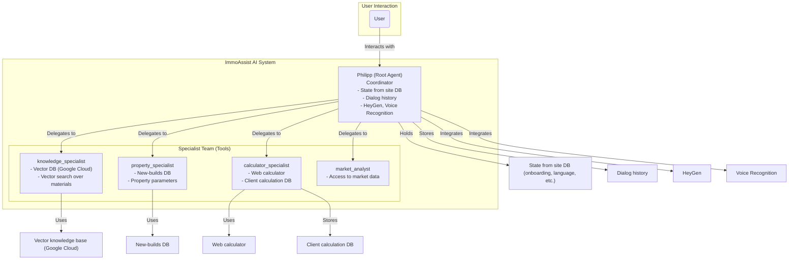

# ImmoAssist: AI-Powered Real Estate Investment Advisor

[](https://opensource.org/licenses/Apache-2.0)
[](https://www.python.org/downloads/)
[](https://google.github.io/adk-docs/)
[](https://github.com/immoassist)

An enterprise-grade, multi-agent AI system for 24/7 real estate investment consulting in Germany. Built with Google's Agent Development Kit (ADK), this project provides expert advice on German new-build properties.

## Architecture Overview

Extended architecture of ImmoAssist with agents, tools, and integrations:



### Key Component Implementation

- **Vector knowledge base**: All materials (FAQ, handbooks, guides) are indexed and stored in a vector DB on Google Cloud. Retrieval is performed via vector search for relevant answers.
- **Calculator**: The same calculator as on the website is used. All calculations per client are stored in a dedicated DB for analytics and personalization.
- **New-builds DB**: All properties and their parameters are stored in a centralized DB, accessible to the property_specialist.
- **Root agent state**: All user data (language, onboarding results, etc.) is stored in the site DB and available to the root agent for personalized dialog.
- **Dialog history**: All user interactions are stored for personalization and analytics.
- **HeyGen & Voice Recognition**: Integration with HeyGen for avatar video generation and with a speech recognition service for voice input/output.

## Technology Stack

- **Programming Language**: Python 3.11+
- **Framework**: Google Agent Development Kit (ADK)
- **Web Server**: Uvicorn / FastAPI (via ADK)
- **Frontend**: (Planned) React/TypeScript (see gemini-fullstack inspiration)
- **Vector Database**: Google Cloud Vertex AI Matching Engine (for semantic search)
- **Relational Database**: (Planned) PostgreSQL or Google Cloud SQL (for user state, calculations, property data)
- **Authentication**: Google Cloud IAM, OAuth2 (planned)
- **Voice & Avatar Integration**: HeyGen API, Speech-to-Text API (Google or other)
- **Testing**: Pytest
- **Code Quality**: Black, Ruff
- **Dependency Management**: requirements.txt (current), **Poetry** (recommended for future)
- **CI/CD**: GitHub Actions (planned)
- **Cloud Infrastructure**: Google Cloud Platform (GCP), Docker (future)
- **Monitoring/Logging**: Google Cloud Logging, Sentry (future)
- **ML Training Pipeline**: (Planned) Vertex AI Pipelines or custom MLflow pipeline for fine-tuning and retraining models

### Recommendations for Future Development

- **Switch to Poetry** for dependency and environment management for better reproducibility and packaging.
- **Implement a full ML training pipeline** for custom model fine-tuning and retraining (Vertex AI Pipelines or MLflow).
- **Frontend**: Develop a modern React/TypeScript frontend for a seamless user experience.
- **Scalable cloud infrastructure**: Use Docker and Kubernetes for scalable deployments.
- **Advanced analytics**: Integrate with BigQuery or similar for deep analytics on user interactions and investment trends.
- **Automated testing & CI/CD**: Set up GitHub Actions for automated testing, linting, and deployment.
- **Data privacy & compliance**: Ensure GDPR compliance for all user data and dialog history storage.

## 🚀 Getting Started

### Prerequisites

- Python 3.11 or higher
- A Google Cloud Project with the Vertex AI API enabled.
- Authenticated Google Cloud CLI.

### Installation & Setup

1.  **Clone the repository:**

    ```bash
    git clone https://github.com/your-org/immoassist.git
    cd immoassist
    ```

2.  **Create a virtual environment and install dependencies:**

    ```bash
    python -m venv venv
    source venv/bin/activate  # On Windows, use: venv\Scripts\activate
    pip install -r requirements.txt
    pip install -r requirements-dev.txt # For development tools
    ```

3.  **Configure your environment:**
    Set the `GOOGLE_CLOUD_PROJECT` environment variable. You can do this permanently in your system or create a `.env` file in the project root.

    ```
    GOOGLE_CLOUD_PROJECT="your-gcp-project-id"
    ```

    The application will load this automatically. For optional integrations (HeyGen, ElevenLabs), add their respective API keys to this file.

4.  **Authenticate with Google Cloud:**
    If you haven't already, log in with the gcloud CLI.
    ```bash
    gcloud auth application-default login
    ```

### Running the Agent

To run the application, simply execute the `run_agent.py` script:

```bash
python run_agent.py
```

This will start the web server. You can interact with your agent by navigating to:

**`http://localhost:8000`**

The web interface is provided by the Google Agent Development Kit.

## 🏗️ Project Structure

The project follows a clean, modular structure for easy maintenance and scalability.

```
immoassist/
├── app/                  # Main application package
│   ├── __init__.py       # Makes 'app' a package
│   ├── agent.py          # Core multi-agent system definition
│   ├── config.py         # Application configuration
│   ├── models/           # Pydantic data models
│   └── tools/            # Specialist tools (e.g., knowledge, property)
├── data/                 # Knowledge base for RAG
│   ├── FAQ/
│   └── Handbücher/
├── tests/                # Test suite
├── run_agent.py          # Simple application runner script
├── pyproject.toml        # Project metadata and dependencies
└── requirements.txt      # Production dependencies
```

## Code Quality & Development

This project adheres to high code quality standards.

- **Formatting**: Black and Ruff for consistent, clean code.
- **Type Hinting**: Fully type-hinted for clarity and static analysis.
- **Testing**: Pytest for unit and integration tests (framework in place).
- **SOLID Principles**: The architecture is designed following SOLID principles for robustness and scalability.

### Running Tests

The test framework is set up. To run tests:

```bash
pytest
```

(Note: Test cases need to be implemented.)

## 🌱 Future Architectural Enhancements

This project has a solid foundation. For future scaling and to incorporate more advanced patterns seen in flagship examples like `gemini-fullstack`, the following enhancements can be considered:

1.  **Agent-based Self-Correction (Critique & Refine Cycle):**

    - **Concept:** Introduce a "Critic Agent" that evaluates the output of specialist agents. If the quality is below a certain threshold (e.g., the information is incomplete or not well-explained), the critic can trigger a refinement loop, forcing the specialist agent to revise its work.
    - **Benefit:** Creates a self-improving system that ensures higher quality and more reliable responses without manual intervention.

2.  **Advanced Workflows (`SequentialAgent` & `LoopAgent`):**

    - **Concept:** For complex, multi-step user requests (e.g., "Find me a property in Berlin and generate a full investment proposal"), orchestrate the workflow using `SequentialAgent`. This allows chaining multiple specialists (e.g., `property_specialist` -> `calculator_specialist` -> report generation) in a predictable pipeline.
    - **Benefit:** De-clutters the root agent's logic and makes complex processes more robust and easier to debug.

3.  **Direct Agent-to-Agent (A2A) Communication:**

    - **Concept:** As the system grows, allow specialists to communicate directly with each other instead of routing everything through Philipp. For example, the `property_specialist`, after finding a suitable object, could directly query the `calculator_specialist` to get its ROI and then return the enriched data to Philipp.
    - **Benefit:** Reduces the load on the central coordinator, creates more dynamic and efficient interactions, and allows for more complex collaborative behaviors between agents.

4.  **Structured Outputs with Pydantic:**

    - **Concept:** For tools and agents that must return data in a reliable format (especially the `calculator_specialist`), define a Pydantic `output_schema`. This forces the LLM to return a validated JSON object.
    - **Benefit:** Greatly increases the system's robustness by eliminating errors from parsing unstructured text and ensuring data consistency.

5.  **Callbacks for Post-Processing:**
    - **Concept:** Implement `after_agent_callback` functions for tasks that need to happen after an agent runs, such as cleaning up the final text, standardizing formatting, or logging analytics data.
    - **Benefit:** Separates the core agent logic from "side-effect" tasks like formatting and logging, making the code cleaner.

---

**ImmoAssist** - Your trusted AI advisor for German real estate investments.
