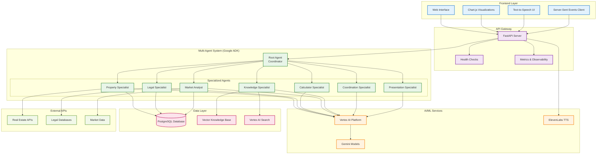

# ImmoAssist: AI-Powered German Real Estate Investment Platform

**Python Version** | **Google ADK** | **Gemini 2.5**

Профессиональная многоагентная AI-система для консультирования по инвестициям в немецкую недвижимость. Построена на Google Agent Development Kit (ADK) со специализированными доменными экспертами, продвинутой визуализацией данных и комплексной базой знаний на основе RAG.

## Архитектура системы



## Технологический стек

### Backend

- **Google ADK 1.8.0** - Фреймворк для разработки многоагентных AI-систем
- **Vertex AI Platform 1.106.0** - Платформа машинного обучения Google Cloud
- **FastAPI 0.115.14** - Асинхронный веб-фреймворк
- **SQLAlchemy 2.0.42** - ORM для работы с базой данных
- **PostgreSQL** - Основная база данных
- **Alembic 1.16.4** - Миграции базы данных

### Frontend

- **Vanilla JavaScript (ES6+)** - Модульная архитектура без фреймворков
- **Chart.js 4.4.1** - Библиотека для визуализации данных
- **Server-Sent Events (SSE)** - Реального времени коммуникация
- **Web Speech API** - Голосовое взаимодействие

### AI/ML Services

- **Gemini 2.5 Flash** - Основная языковая модель
- **Vertex AI Search** - Семантический поиск по знаниям
- **ElevenLabs API** - Синтез речи
- **Vector Embeddings** - Векторное представление данных

### DevOps & Monitoring

- **Docker** - Контейнеризация
- **Poetry** - Управление зависимостями Python
- **Health Checks** - Мониторинг состояния системы
- **Observability** - Метрики и логирование

## Архитектура агентов

### Root Agent (Координатор)

- **Роль**: Главный координатор запросов пользователей
- **Функции**: Маршрутизация запросов к специализированным агентам
- **Паттерн**: Coordinator/Dispatcher с LLM-driven delegation

### Property Specialist

- **Роль**: Специалист по анализу недвижимости
- **Функции**:
  - Анализ характеристик объектов недвижимости
  - Оценка инвестиционного потенциала
  - Поиск и фильтрация объектов
- **Инструменты**: Интеграция с порталами недвижимости, базы данных объектов

### Legal Specialist

- **Роль**: Юридический консультант
- **Функции**:
  - Анализ правовых аспектов сделок
  - Консультации по немецкому законодательству
  - Проверка документооборота
- **Инструменты**: Доступ к правовым базам данных, анализ документов

### Calculator Specialist

- **Роль**: Финансовый аналитик
- **Функции**:
  - Расчет доходности инвестиций
  - Анализ налоговых последствий
  - Моделирование финансовых сценариев
- **Инструменты**: Финансовые калькуляторы, налоговые модели

### Market Analyst

- **Роль**: Аналитик рынка недвижимости
- **Функции**:
  - Анализ рыночных трендов
  - Прогнозирование стоимости
  - Сравнительный анализ районов
- **Инструменты**: Доступ к рыночным данным, аналитическим сервисам

### Knowledge Specialist

- **Роль**: Специалист по управлению знаниями
- **Функции**:
  - Поиск по базе знаний
  - Предоставление справочной информации
  - Семантический поиск
- **Инструменты**: Vertex AI Search, векторные базы данных

### Coordination Specialist

- **Роль**: Координатор межагентного взаимодействия
- **Функции**:
  - Управление сложными мультиагентными процессами
  - Синхронизация данных между агентами
  - Контроль качества результатов

### Presentation Specialist

- **Роль**: Специалист по представлению данных
- **Функции**:
  - Форматирование ответов для пользователя
  - Создание визуализаций
  - Генерация отчетов
- **Инструменты**: Chart.js интеграция, шаблоны отчетов

## Паттерны взаимодействия агентов

### Sequential Pipeline

Используется для поэтапной обработки запросов:

```
Анализ запроса → Поиск данных → Расчеты → Представление результатов
```

### Parallel Fan-Out/Gather

Применяется для одновременного сбора информации:

```
Запрос пользователя → [Property Data | Legal Info | Market Analysis] → Синтез результатов
```

### Coordinator/Dispatcher

Центральная маршрутизация запросов к специалистам:

```
Root Agent → Определение типа запроса → Делегирование специалисту → Агрегация ответа
```

## Frontend архитектура

### Модульная система

- **agentClient.js** - Клиент для взаимодействия с агентами
- **apiClient.js** - HTTP клиент для API запросов
- **chatUI.js** - Интерфейс чата
- **chartRenderer.js** - Рендеринг диаграмм Chart.js
- **speechManager.js** - Управление голосовыми функциями
- **languageManager.js** - Мультиязычная поддержка

### Коммуникация в реальном времени

- **Server-Sent Events (SSE)** для потокового получения ответов агентов
- **WebSocket fallback** для браузеров без SSE поддержки
- **Голосовой интерфейс** с интеграцией ElevenLabs TTS

### Визуализация данных

- **Chart.js интеграция** для финансовых графиков
- **Интерактивные диаграммы** доходности и рыночных трендов
- **Адаптивный дизайн** для различных устройств

## База данных

### Основные модели данных

- **Property** - Модель объектов недвижимости
- **User** - Пользователи системы
- **Financial** - Финансовые данные и расчеты
- **OutputSchemas** - Схемы вывода данных

### Миграции

Используется Alembic для версионирования изменений схемы базы данных.

## Установка и развертывание

### Требования

- Python 3.9+
- PostgreSQL 12+
- Google Cloud Project с включенными API:
  - Vertex AI API
  - Cloud Storage API
  - Compute Engine API

### Локальная разработка

1. **Клонирование репозитория**

```bash
git clone <repository-url>
cd immoassist
```

2. **Настройка Poetry**

```bash
poetry install
poetry shell
```

3. **Настройка переменных окружения**

```bash
cp .env.example .env
# Отредактируйте .env с вашими настройками
```

4. **Настройка базы данных**

```bash
poetry run alembic upgrade head
```

5. **Запуск приложения**

```bash
poetry run python run_agent.py
```

### Переменные окружения

#### Google Cloud

```env
GOOGLE_GENAI_USE_VERTEXAI=True
GOOGLE_CLOUD_PROJECT=your-project-id
GOOGLE_CLOUD_LOCATION=europe-west3
GOOGLE_APPLICATION_CREDENTIALS=path/to/credentials.json
```

#### Модели AI

```env
MODEL_NAME=gemini-2.5-flash
SPECIALIST_MODEL=gemini-2.5-flash
CHAT_MODEL=gemini-2.5-flash
```

#### База данных

```env
DATABASE_HOST=localhost
DATABASE_PORT=5432
DATABASE_NAME=immoassist
DATABASE_USER=username
DATABASE_PASSWORD=password
```

#### Внешние сервисы

```env
ELEVENLABS_API_KEY=your-elevenlabs-key
```

### Docker развертывание

```bash
# Сборка образа
docker build -t immoassist .

# Запуск контейнера
docker run -p 8000:8000 --env-file .env immoassist
```

### Production развертывание

Для production развертывания рекомендуется использовать:

- **Google Cloud Run** для автомасштабирования
- **Cloud SQL** для управляемой PostgreSQL
- **Cloud Storage** для статических файлов
- **Cloud Load Balancer** для высокой доступности

## API документация

### Основные эндпоинты

#### Чат с агентами

```
POST /agents/{agent_name}/chat
```

#### Потоковый ответ

```
GET /agents/{agent_name}/stream
```

#### Text-to-Speech

```
POST /tts-stream
```

#### Мониторинг

```
GET /health - Проверка здоровья системы
GET /metrics - Метрики приложения
GET /ready - Готовность к обслуживанию
GET /alive - Проверка жизнеспособности
```

## Мониторинг и observability

### Health Checks

- **Vertex AI connectivity** - Проверка подключения к Vertex AI
- **Database connectivity** - Проверка подключения к PostgreSQL
- **External APIs** - Проверка доступности внешних сервисов

### Метрики

- **Время ответа агентов**
- **Использование ресурсов**
- **Частота запросов**
- **Коэффициент ошибок**

### Логирование

Структурированные логи с уровнями:

- ERROR - Критические ошибки
- WARNING - Предупреждения
- INFO - Информационные сообщения
- DEBUG - Отладочная информация

## Добавление нового функционала

### Создание нового агента

1. **Создайте prompt файл**

```python
# app/prompts/new_specialist_focused.py
NEW_SPECIALIST_PROMPT = """
Вы являетесь специалистом по [область].
Ваши задачи:
- [задача 1]
- [задача 2]
"""
```

2. **Создайте инструменты агента**

```python
# app/tools/new_specialist_tools.py
from google.adk.tools import FunctionTool

async def new_specialist_function(param: str) -> str:
    """Описание функции."""
    # Логика функции
    return result
```

3. **Зарегистрируйте агента**

```python
# app/agent.py
from .prompts import NEW_SPECIALIST_PROMPT
from .tools.new_specialist_tools import new_specialist_function

new_specialist = Agent(
    name="new_specialist",
    model=config.specialist_model,
    instruction=NEW_SPECIALIST_PROMPT,
    description="Краткое описание специалиста",
    tools=[FunctionTool(func=new_specialist_function)]
)
```

### Добавление новой интеграции

1. **Создайте клиент API**

```python
# app/services/new_service.py
import httpx

class NewServiceClient:
    async def get_data(self, query: str):
        # Логика интеграции
        pass
```

2. **Создайте инструмент**

```python
# app/tools/new_integration_tools.py
from ..services.new_service import NewServiceClient

async def search_new_service(query: str) -> str:
    client = NewServiceClient()
    return await client.get_data(query)
```

### Расширение frontend

1. **Добавьте новый модуль**

```javascript
// frontend/newFeature.js
export class NewFeature {
  constructor() {
    this.init();
  }

  init() {
    // Инициализация функциональности
  }
}
```

2. **Интегрируйте в main script**

```javascript
// frontend/script.js
import { NewFeature } from './newFeature.js';

const newFeature = new NewFeature();
```

## Переход на React

Для перехода с Vanilla JS на React:

### 1. Настройка React проекта

```bash
# В папке frontend
npx create-react-app react-frontend
cd react-frontend
npm install axios chart.js react-chartjs-2
```

### 2. Миграция компонентов

- **chatUI.js** → `components/Chat/ChatInterface.jsx`
- **chartRenderer.js** → `components/Charts/ChartRenderer.jsx`
- **speechManager.js** → `hooks/useSpeechManager.js`

### 3. Управление состоянием

```bash
npm install @reduxjs/toolkit react-redux
```

### 4. Интеграция с API

```javascript
// services/api.js
import axios from 'axios';

const API_BASE = '/api';

export const chatWithAgent = async (agentName, message) => {
  const response = await axios.post(`${API_BASE}/agents/${agentName}/chat`, {
    message,
  });
  return response.data;
};
```

## Тестирование

### Unit тесты

```bash
poetry run pytest tests/
```

### Интеграционные тесты

```bash
poetry run pytest tests/integration/
```

### E2E тесты

```bash
# Для frontend тестирования с Playwright
npm install @playwright/test
```

## Безопасность

### Аутентификация

- Google Cloud IAM для сервисных аккаунтов
- JWT токены для пользовательских сессий

### Авторизация

- RBAC модель для доступа к агентам
- Rate limiting для API эндпоинтов

### Защита данных

- Шифрование данных в transit и at rest
- Аудит логи для отслеживания действий

## Производительность

### Backend оптимизации

- Асинхронное выполнение агентов
- Кэширование частых запросов
- Connection pooling для базы данных

### Frontend оптимизации

- Lazy loading компонентов
- Оптимизация Bundle size
- CDN для статических ресурсов

## Roadmap

### Ближайшие планы

- [ ] Переход на React frontend
- [ ] Интеграция с дополнительными порталами недвижимости
- [ ] Расширение языковой поддержки

### Долгосрочные цели

- [ ] AI-powered прогнозирование рынка
- 
